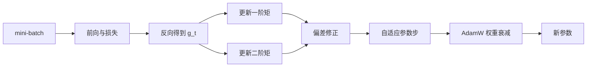

# 优化器：SGD、Momentum 与 Adam

## 学习目标

从一阶优化目标推导 SGD、Momentum 与 Adam 的更新；解释动量、二阶矩估计和偏差修正各自解决什么；区分 L2 正则化与 AdamW 的解耦权重衰减；能够设计公平的优化器比较，而不是写出“Adam 默认最优”之类脱离任务与预算的结论。

## 前置知识

需要梯度、链式法则、mini-batch 经验风险和向量逐元素运算。记参数为 $\theta_t$，第 $t$ 步 mini-batch 梯度为 $g_t=\nabla_\theta L_t(\theta_{t-1})$，学习率为 $\eta_t$。所有除法、平方和平方根在 Adam 中按坐标逐元素执行。

## 核心概念与符号表

最基础的 SGD 更新为

$$
\theta_t=\theta_{t-1}-\eta_t g_t.
$$

随机梯度不是完整数据梯度，但在合适采样下可看作其噪声估计。mini-batch 越小，单步方差通常越大；这不自动意味着泛化更好，吞吐、归一化和学习率缩放会共同改变训练动力学。

Momentum 使用指数移动平均积累方向；Adam 同时维护一阶矩 $m_t$ 与未中心化二阶矩 $v_t$。$\beta_1,\beta_2\in[0,1)$ 控制记忆长度，$\epsilon$ 防止除零并影响极小梯度坐标的有效步长。

## 公式来源与推导

### Momentum：低通滤波与惯性

一种常见写法是

$$
v_t=\mu v_{t-1}+g_t,\qquad
\theta_t=\theta_{t-1}-\eta_t v_t.
$$

展开递推可得

$$
v_t=g_t+\mu g_{t-1}+\mu^2g_{t-2}+\cdots,
$$

所以近期梯度权重大、久远梯度指数衰减。若某方向长期同号，累积使移动加速；若狭长谷底横向梯度反复变号，它们会部分抵消。不同框架可能把 $(1-\mu)$ 乘进梯度或把 velocity 符号反过来，比较超参数前必须先核对实现。

### Adam：尺度归一化与偏差修正

Adam 的原始形式为

$$
\begin{aligned}
m_t&=\beta_1m_{t-1}+(1-\beta_1)g_t,\\
v_t&=\beta_2v_{t-1}+(1-\beta_2)g_t^2.
\end{aligned}
$$

初始化 $m_0=v_0=0$ 会让早期估计偏向零。若梯度均值近似恒定为 $\bar g$，则 $\mathbb E[m_t]=(1-\beta_1^t)\bar g$，因此用

$$
\hat m_t=\frac{m_t}{1-\beta_1^t},\qquad
\hat v_t=\frac{v_t}{1-\beta_2^t}
$$

修正初始化偏差。参数更新为

$$
\theta_t=\theta_{t-1}-\eta_t\frac{\hat m_t}{\sqrt{\hat v_t}+\epsilon}.
$$

分母让历史梯度平方较大的坐标拥有较小的归一化步长。它不是 Hessian 逆，也不等价于真正的二阶优化；$v_t$ 只是按坐标的梯度平方统计，忽略跨坐标曲率。

### AdamW：为什么要解耦权重衰减

在普通 SGD 中，把 $\lambda\lVert\theta\rVert_2^2/2$ 加到损失会给梯度增加 $\lambda\theta$，与乘法衰减近似对应。但在 Adam 中，这个梯度也会被 $1/\sqrt{\hat v_t}$ 按坐标缩放，正则化强度不再统一。AdamW 将衰减直接作用于参数：

$$
\theta_t=(1-\eta_t\lambda)\theta_{t-1}
-\eta_t\frac{\hat m_t}{\sqrt{\hat v_t}+\epsilon}.
$$

这使优化梯度的自适应缩放与参数衰减分开。偏置和归一化缩放参数是否衰减属于模型设计选择，很多训练配方会排除它们，但不能机械套用。

## 完整数值例子

考虑一维参数，$g_1=2$，Adam 取 $\beta_1=0.9$、$\beta_2=0.999$，先忽略 $\epsilon$。初始化为零：

$$
m_1=0.1\times2=0.2,\qquad v_1=0.001\times4=0.004.
$$

未修正更新比例为 $0.2/\sqrt{0.004}\approx3.162$，明显受初始化影响。偏差修正后

$$
\hat m_1=0.2/(1-0.9)=2,
\qquad
\hat v_1=0.004/(1-0.999)=4,
$$

所以归一化方向为 $2/\sqrt4=1$。若 $\eta=10^{-3}$，第一步参数减少约 $10^{-3}$。这也揭示 Adam 的尺度性质：当单一梯度远大于 $\epsilon$ 且历史尚短时，梯度幅度在分子与分母中大致抵消，步长主要由学习率控制。

下面的最小代码用于核对两步状态：

```python
beta1, beta2, eps = 0.9, 0.999, 1e-8
m = v = 0.0
for t, g in enumerate([2.0, -1.0], start=1):
    m = beta1 * m + (1 - beta1) * g
    v = beta2 * v + (1 - beta2) * g * g
    m_hat = m / (1 - beta1**t)
    v_hat = v / (1 - beta2**t)
    step = m_hat / (v_hat**0.5 + eps)
    print(t, m_hat, v_hat, step)
```

第二步梯度反向时，一阶矩不会立刻翻转，体现动量；二阶矩仍为正，控制坐标尺度。

## 训练数据流



## 如何公平比较优化器

至少固定模型、数据顺序、总 token/样本数、增强、精度、梯度裁剪与评测代码；分别为每个优化器调学习率和调度器，因为共用一个学习率会偏向某种算法。报告 wall-clock、吞吐、峰值显存、达到目标指标的步数以及多个种子的均值/离散程度。若一个优化器训练更快但最终泛化稍差，应呈现 Pareto 关系，而不是只挑一个终点。

Adam 常在稀疏梯度、Transformer 和有限调参预算下快速获得可用结果；带动量 SGD 在部分视觉任务中可能获得有竞争力的最终泛化。两者都不是跨任务默认最优，训练配方（warmup、weight decay、batch size、归一化）往往与优化器同样重要。

## 常见错误、适用条件与反例

1. **“Adam 总是收敛更快/更好”。** 要区分训练损失、验证指标、达到阈值时间和最终性能。
2. **漏掉偏差修正。** 早期矩估计会系统偏小；某些变体通过不同参数化补偿，必须核对实现。
3. **把 Adam 二阶矩叫作方差。** $v_t$ 是未中心化二阶矩估计，不是 $\mathbb E[(g-\mathbb E g)^2]$。
4. **把 L2 正则与 AdamW 当成完全相同。** 自适应预条件使二者通常不等价。
5. **恢复训练只加载参数。** 优化器状态、调度器、梯度缩放器与步数也要恢复，否则动力学突变。
6. **无条件使用默认 $\epsilon$。** 低精度或极小梯度场景中它可能显著改变有效步长。

## 与前后章节的关系

本节依赖反向传播，向后连接学习率调度、梯度裁剪、混合精度与归一化。LayerNorm 改变梯度尺度，优化器又依据梯度历史调整步长，两者共同决定训练稳定性，不能孤立调参。

## 自测题与答案提示

1. 若常数梯度 $g$ 持续出现，$m_t$ 的期望是多少？提示：$g(1-\beta_1^t)$。
2. 为什么不同优化器不应强行共用学习率？提示：更新方向的尺度和预条件不同。
3. `zero_grad` 漏掉会发生什么？提示：多数框架默认梯度累加，实际 batch 与更新方向改变。
4. AdamW 中权重衰减与学习率为何耦合？提示：每步乘子含 $\eta_t\lambda$，调度器也会改变总衰减量。

## 参考资料

- Kingma & Ba, *Adam: A Method for Stochastic Optimization*。
- Loshchilov & Hutter, *Decoupled Weight Decay Regularization*。
- PyTorch Optimizer 文档：核对具体实现、参数顺序和状态恢复。

## 校对信息

最后校对：2026-07-21。掌握状态：复习中。已补回偏差修正、AdamW 区别与数值例子；不再保留“默认最优”的过度概括。

