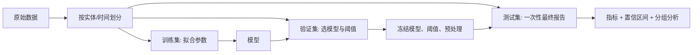

# 分类指标与可靠评估

## 学习目标

能够从混淆矩阵推导 accuracy、precision、recall、specificity 与 F1；理解阈值变化为什么沿 PR/ROC 曲线移动；根据类别不平衡和错误代价选择主指标；设计没有数据泄漏的训练、验证、测试协议，并报告随机种子带来的不确定性。

## 前置知识

需要概率、条件概率、二分类器输出分数 $s(x)$、训练/验证/测试集划分。默认正类为业务上重点关注的事件，但“正类”不等于道德上的“好”。所有指标都依赖正类定义和采样分布。

## 核心概念与符号表

二分类混淆矩阵有 TP、FP、TN、FN 四个计数。记真实正类数 $P=TP+FN$，真实负类数 $N=TN+FP$，总数 $M=P+N$。

$$
\text{accuracy}=\frac{TP+TN}{M},\quad
\text{precision}=\frac{TP}{TP+FP},\quad
\text{recall}=\frac{TP}{TP+FN}.
$$

specificity 为 $TN/(TN+FP)$；false positive rate 为 $FPR=1-\text{specificity}$。F1 是 precision 和 recall 的调和平均：

$$
F_1=2\frac{PR}{P+R}=\frac{2TP}{2TP+FP+FN}.
$$

调和平均对较小值更敏感，因此只有 precision 与 recall 同时较高时 F1 才高，但 F1 完全不使用 TN，未必适合负类同样重要的任务。

## 公式推导与直觉

precision 回答“模型判为正的样本中有多少真的为正”，条件方向近似 $P(Y=1\mid\hat Y=1)$；recall 回答“所有真实正类中找回多少”，近似 $P(\hat Y=1\mid Y=1)$。两者分母不同，不能互换。

将分数 $s(x)$ 与阈值 $\tau$ 比较：$s(x)\ge\tau$ 判正。降低 $\tau$ 会把更多样本判正，TP 通常不减、FP 也通常不减，于是 recall 不降，但 precision 可能上升也可能下降，取决于新加入样本的正类比例。ROC 曲线画 $(FPR,TPR)$；PR 曲线画 $(recall,precision)$。ROC-AUC 衡量随机正样本得分高于随机负样本的排序概率，但在极端不平衡任务上，即使 FP 数量很大，FPR 的分母 $N$ 也可能让曲线看起来良好；PR 更直接反映预测正类的纯度。

若错误代价已知，更合理的决策不是最大化 F1，而是最小化期望代价。设假阳性代价 $C_{FP}$、假阴性代价 $C_{FN}$，校准后的正类概率为 $p(x)$。判正的条件是

$$
C_{FP}[1-p(x)] \le C_{FN}p(x),
$$

即

$$
p(x)\ge \frac{C_{FP}}{C_{FP}+C_{FN}}.
$$

这说明阈值来自成本与概率校准，而不是固定等于 $0.5$。

## 完整数值例子

某筛查模型在 1000 个样本上得到：TP=72、FN=8、FP=92、TN=828。真实患病率为 $80/1000=8\%$。

- accuracy $=(72+828)/1000=0.90$；
- precision $=72/(72+92)\approx0.439$；
- recall $=72/80=0.90$；
- specificity $=828/920=0.90$；
- F1 $=144/(144+92+8)=144/244\approx0.590$。

虽然 accuracy 为 90%，但一个“全部判负”的模型也有 92% accuracy。当前模型的价值在于找回 90% 正类，但每 164 个报警只有 72 个真阳性。是否可接受取决于复检成本和漏诊代价，不能只看一个数字。

用 Python 复算：

```python
tp, fn, fp, tn = 72, 8, 92, 828
accuracy = (tp + tn) / (tp + fn + fp + tn)
precision = tp / (tp + fp)
recall = tp / (tp + fn)
f1 = 2 * precision * recall / (precision + recall)
assert round(accuracy, 3) == 0.900
assert round(precision, 3) == 0.439
assert round(recall, 3) == 0.900
assert round(f1, 3) == 0.590
```

## 数据流与评估协议



预处理、特征选择、过采样与阈值选择都必须只使用训练/验证信息。若同一人的多条记录跨越训练和测试，模型可能记住个体而非学习可泛化规律；时间序列任务应按时间切分，部署分布变化还需额外的时间外测试。

## 常见错误、适用条件与反例

1. **在测试集调阈值。** 测试集被反复查看后就变成验证集，最终分数乐观。
2. **只报告 accuracy。** 类别不平衡时，简单多数类预测即可获得高 accuracy。
3. **把 AUC 当作部署性能。** AUC 汇总所有阈值，包括实际永远不会采用的区域；必须同时报告选定阈值下的混淆矩阵。
4. **比较不同测试集上的指标。** prevalence 改变会显著改变 precision，跨数据集数值不能脱离分布比较。
5. **先全数据标准化再交叉验证。** 测试折的信息泄漏进均值和方差。应把预处理放入每一折的 pipeline。
6. **单随机种子定胜负。** 小数据或随机训练需要多个种子，报告均值、标准差或置信区间。

## 与前后章节的关系

本节依赖概率中的条件概率，向前连接损失函数和类别不平衡学习，向后连接校准、分布漂移、公平性与实验统计。对于 VLA 成功率，二项置信区间、任务分层与每任务 trial 数同样重要；不能把所有任务简单合并成一个成功率。

## 自测题与答案提示

1. TP=30、FP=10、FN=20、TN=940，求五个基础指标。提示：accuracy 很高，但 recall 只有 $0.6$。
2. 降低阈值时 recall 为什么不会下降？提示：原先判正集合包含在新判正集合中，前提是同一批固定分数。
3. 为什么 PR-AUC 会受正类比例影响？提示：precision 的分母包含 FP，采样更多负类会改变它。
4. 何时优先报告 macro-F1？提示：多分类且希望每个类别等权；但仍应给出逐类指标和样本数。

## 参考资料

- scikit-learn User Guide, *Metrics and scoring*：指标定义与 API。
- Google Machine Learning Crash Course, *Classification metrics*：混淆矩阵、precision 与 recall。
- 真实项目还需结合领域成本、数据采样与监管要求，不能由通用指标替代。

## 校对信息

最后校对：2026-07-21。掌握状态：复习中。数值例子已用独立代码复算；后续补充 bootstrap 置信区间与概率校准专题。

