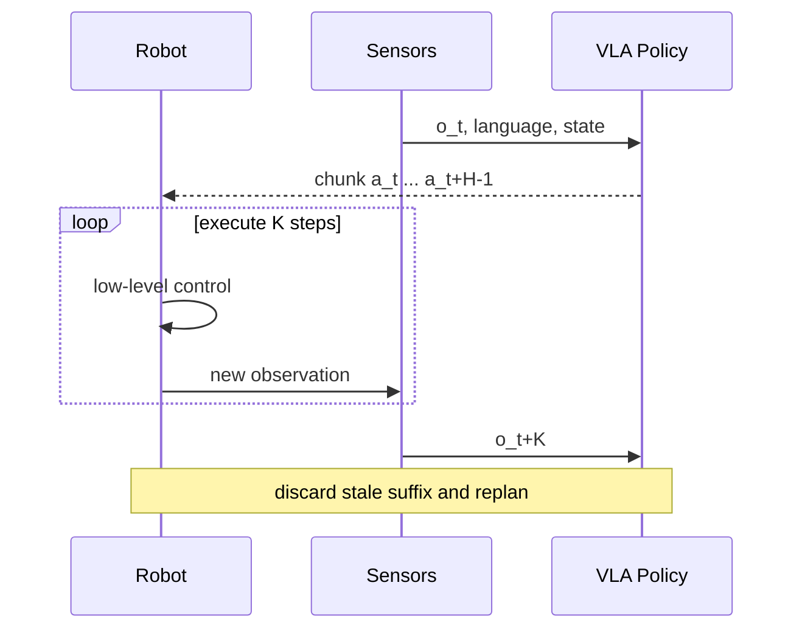

# 动作分块与闭环执行

## 学习目标

区分单步策略、动作分块、开环执行与滚动时域重规划；计算控制频率、推理延迟和 chunk 长度之间的时间预算；解释长动作块为何提升连贯性又可能降低反馈反应；设计训练标签、掩码和评测指标，避免把离线动作误差当作闭环成功率。

## 前置知识

需要离散时间控制、行为克隆、序列模型和 VLA 输入输出。记环境控制周期为 $\Delta t_c$，控制频率 $f_c=1/\Delta t_c$；模型每次预测长度 $H$ 的动作块 $\hat a_{t:t+H-1}$；执行 $K\le H$ 步后重新观察和规划。

## 核心概念与符号表

单步策略每次输出 $\hat a_t=\pi(o_t,l)$，理论上反馈最及时，但大模型每个控制周期运行一次可能来不及。动作分块策略输出

$$
\hat A_t=(\hat a_t,\hat a_{t+1},\ldots,\hat a_{t+H-1})
=\pi(o_{\le t},l),
$$

把多个相邻动作联合建模。若一次预测后完整执行 $H$ 步，就是开环 chunk；若只执行前 $K$ 步再用新观测重算，就是 receding-horizon（滚动时域）执行。

动作分块可以减少模型调用次数，学习局部动作连贯性，并缓解行为克隆中相邻时刻动作的高频抖动。但预测后半段基于旧观测，外界扰动、接触变化和模型误差会让它迅速过时。

## 时间预算推导

模型推理耗时为 $T_{inf}$。单步同步控制要求

$$
T_{inf}\le \Delta t_c.
$$

若一次输出 $H$ 步并执行 $K$ 步，重规划间隔为 $K\Delta t_c$，同步系统只需满足

$$
T_{inf}\le K\Delta t_c,
$$

但信息年龄会增加。第 $j$ 个动作执行时，其视觉观测至少陈旧约 $T_{inf}+j\Delta t_c$。因此扩大 $K$ 能缓解算力约束，却增加反馈延迟。

异步推理可在机器人执行旧 chunk 时计算新 chunk。若推理开始于时刻 $t$，返回时系统已推进 $r=\lceil T_{inf}/\Delta t_c\rceil$ 步，那么新动作块前 $r$ 步可能已经过期。系统需要丢弃前缀、预测未来起点，或将近期状态再次送入轻量修正器；直接从第一个动作执行会引入时序错位。

## 训练目标与动作平滑

最简单的连续动作行为克隆损失是

$$
L(\theta)=\frac1H\sum_{j=0}^{H-1}
\lVert \pi_\theta(o_t,l)_j-a_{t+j}\rVert_1.
$$

若演示在 episode 结尾不足 $H$ 步，需要 padding mask，防止填充值参与损失。不同动作维的单位和尺度差异很大，通常先按训练集统计归一化；统计量在评测时必须冻结。

可加入速度或加速度平滑项，例如

$$
L_{smooth}=\frac1{H-1}\sum_{j=1}^{H-1}
\lVert \hat a_{t+j}-\hat a_{t+j-1}\rVert_2^2.
$$

但平滑不是越强越好：接触建立、快速避障和夹爪闭合可能需要突变。平滑系数应由闭环任务、力峰值与延迟共同评估。

当连续多个时刻产生重叠 chunk，可对同一绝对时刻的多个预测做时间集成：

$$
\bar a_	au=rac{\sum_{t\le\tau}w_{\tau-t}\hat a_{t,\tau-t}}
{\sum_{t\le\tau}w_{\tau-t}},
$$

其中新预测可用更大权重。它降低抖动，却也可能把模式不同的动作平均成不可行中间值；接触切换时尤其要谨慎。

## 完整数值例子

机器人底层控制为 $20\,\mathrm{Hz}$，所以 $\Delta t_c=50\,\mathrm{ms}$。大模型一次推理 $180\,\mathrm{ms}$，无法单步同步控制，因为 $180>50$。

设模型输出 $H=10$ 步（覆盖 $0.5\,\mathrm{s}$），系统执行 $K=4$ 步后重规划。可用计算窗口为

$$
K\Delta t_c=4\times50=200\,\mathrm{ms},
$$

刚好容纳 180 ms 推理，留下 20 ms 调度余量。代价是每次重规划最多使用约 0.2 s 前的视觉信息；若第 4 步才执行，信息年龄还包含推理时间。

若实际推理长尾达到 260 ms，同步 deadline 会错过。只报告平均 180 ms 不够，至少要报告 P95/P99 延迟、deadline miss rate 与超时时的安全策略。可以降低模型频率、提前异步计算或让底层控制器在缺少新 chunk 时进入保持/减速模式。

## 闭环执行图

## 评测设计

动作分块不能只用离线 L1/MSE 评估。公开评测至少记录：任务成功率及每任务 trial 数、完成时间、碰撞/力阈值、安全停止、控制频率、平均与尾部推理延迟、重规划间隔、动作平滑度和扰动恢复。比较不同 $H,K$ 时保持训练数据、模型大小和推理预算一致，分别报告连贯性与反应性。

开放环回放误差低不代表闭环好：演示状态附近的小误差会把机器人带到训练分布外，后续预测面对未见状态。应加入受控扰动，如物体轻微移位或执行延迟，测试恢复能力；但任何真实机器人测试都必须有安全边界和人工急停。

## 常见错误、适用条件与反例

1. **把 $H$ 和 $K$ 混为一谈。** 预测 50 步不意味着必须开环执行 50 步。
2. **只报告平均推理延迟。** 实时系统受尾延迟和 deadline miss 影响。
3. **episode 末尾 padding 参与损失。** 模型会学习无意义的零动作尾巴。
4. **重叠 chunk 无条件平均。** 多模态策略可能被平均到两个模式之间。
5. **更长 chunk 必然更好。** 动态场景、接触丰富任务可能需要更短反馈周期。
6. **把高层 chunk 直接当电机指令。** 许多系统还需要频率更高的低层位置/速度/力控制器和安全限幅。
7. **训练与执行坐标系不一致。** 相机坐标、基座坐标、工具坐标及绝对/增量动作必须固定定义。

## 与前后章节的关系

本节连接行为克隆、序列建模与模型预测控制。OpenVLA 的动作 token 更接近离散自回归输出，π0 用连续 flow matching 生成动作块；两者都必须落到实际控制频率、坐标系和闭环执行策略上比较。

## 自测题与答案提示

1. 控制频率 50 Hz、推理 75 ms，至少执行多少步才能同步容纳一次推理？提示：$\lceil75/20\rceil=4$ 步。
2. $H=20,K=5$ 的闭环重规划周期是多少？提示：$5/f_c$，不是 $20/f_c$。
3. 时间集成为什么可能伤害多峰动作？提示：平均后的动作可能不属于任何可行模式。
4. 如何发现 padding 泄漏？提示：检查 loss mask、episode 尾部预测分布和有效长度统计。

## 参考资料

- Zhao et al., *Learning Fine-Grained Bimanual Manipulation with Low-Cost Hardware*：action chunking 与 temporal ensembling。
- Black et al., *π0*：连续动作块与机器人控制中的 flow matching。

## 校对信息

最后校对：2026-07-21。掌握状态：复习中。时间预算例子、$H/K$ 定义与异步陈旧问题已复核；不含私有实验参数。

