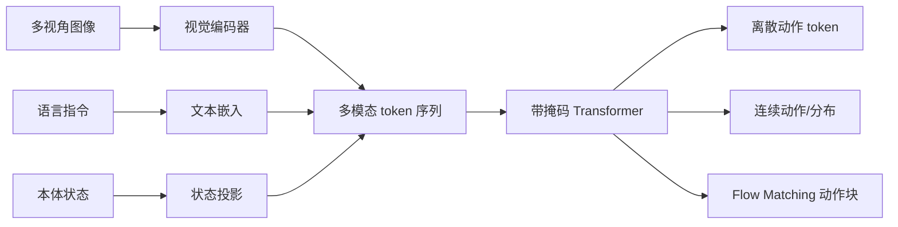

# 从注意力到动作解码

## 学习目标

把 VLA 的图像、语言、本体状态和动作统一成带形状的数据流；推导缩放点积注意力；区分离散动作 token、连续回归、概率分布与 flow matching 动作头；能够检查注意力掩码是否允许信息泄漏；理解“用了 Transformer”并不能自动保证视觉落地、实时控制或跨机器人泛化。

## 前置知识

需要线性代数中的矩阵乘法、softmax、Transformer 基础、监督学习损失与机器人末端/关节动作。记 batch 为 $B$，序列长度为 $L$，隐藏维为 $d$，注意力头数为 $h$，每头维度 $d_h=d/h$。

## 核心概念与符号表

VLA（Vision-Language-Action）策略通常接收视觉观测 $o_t^{img}$、语言指令 $l$，可选本体状态 $s_t$，输出动作 $a_t$ 或动作块 $a_{t:t+H-1}$。视觉编码器把图像转为 patch 特征；投影层将不同模态对齐到共同隐藏维；Transformer 在 token 间交换条件信息；动作解码器把隐藏表示映射到机器人控制空间。

这是一种结构模板，不是统一标准。不同论文可能使用单图/多图、绝对位姿/增量位姿、离散/连续动作、因果/双向注意力和不同控制频率。比较模型前应先对齐观测、动作定义与评测协议。

## 注意力公式推导

输入表示 $X\in\mathbb R^{B\times L\times d}$ 经线性投影得到

$$
Q=XW_Q,quad K=XW_K,quad V=XW_V.
$$

单头缩放点积注意力为

$$
\operatorname{Attn}(Q,K,V)=
\operatorname{softmax}\left(\frac{QK^\top}{\sqrt{d_h}}+M\right)V,
$$

其中 $M$ 是掩码：允许位置加 0，禁止位置加一个足够大的负数。$QK^\top$ 形状为 `[B,h,L_q,L_k]`。若 $q_i,k_j$ 各坐标近似零均值、单位方差，点积方差随 $d_h$ 增长；除以 $\sqrt{d_h}$ 可避免 softmax 在初始化时过早饱和。

每个查询位置得到对所有键的权重，再加权汇总值向量。对 VLA 来说，动作查询可以读取语言与视觉 token；如果训练时某动作位置读取了本应预测的未来真值动作，便发生标签泄漏。掩码必须与“并行预测整个动作块”或“自回归预测下一个动作”的训练目标一致。

多头注意力把隐藏维拆为 $h$ 个子空间：

$$
\operatorname{MHA}(X)=\operatorname{Concat}(head_1,\ldots,head_h)W_O.
$$

不同头可以学习不同的关联模式，但单个注意力权重不能自动解释因果依据；要验证视觉落地，还需要遮挡、反事实输入、指令置换或定位评测。

## 从隐藏状态到动作

### 离散动作 token

对每个动作维度按训练集分位数范围分箱，目标 bin 用交叉熵训练。优点是复用语言模型词表与自回归基础设施；缺点是量化误差、边界饱和、每个维度顺序解码带来的延迟，以及跨机器人动作单位不一致。

若第 $j$ 维范围 $[l_j,u_j]$ 分为 $K$ 桶，等宽示例映射为

$$
k_j=\operatorname{clip}\left(
\left\lfloor K\frac{a_j-l_j}{u_j-l_j}\right\rfloor,0,K-1\right).
$$

反量化通常取桶中心，因此误差上界约为半个桶宽；分位数裁剪会把训练范围外动作压到边界。

### 连续回归与概率建模

直接 MSE 回归最小化 $\lVert \hat a-a\rVert^2$，等价于固定方差高斯的负对数似然。在多模态动作分布中，条件均值可能落在两个可行动作之间而不可执行。混合密度、扩散/flow matching 或离散化可以表达多峰，但训练和采样成本不同。

Flow matching 动作头在噪声动作与数据动作之间定义路径 $a^\tau$，学习速度场 $v_\theta(a^\tau,\tau\mid o,l)$；推理从噪声出发积分 ODE 得到连续动作块。它避免逐维量化，但需要多步数值更新，实时性取决于网络缓存、积分步数和控制周期。

## 完整张量例子

假设 batch $B=2$，两个相机各产生 256 个视觉 token，文本 32 个 token，本体状态投影为 1 个 token，总长度

$$
L=2\times256+32+1=545.
$$

取 $d=1024,h=16,d_h=64$。则 $Q,K,V$ 每头形状为 `[2,16,545,64]`，注意力分数为 `[2,16,545,545]`，单层仅分数张量就含约 $9.5$ 百万个元素。若使用 fp16，约 19 MB，尚未计反向激活。这解释了高分辨率、多相机和长历史为什么迅速增加显存与二次注意力计算。

若最终只预测 7 维单步动作，动作头可把特定 token 的 `[2,1024]` 隐藏状态映射到 `[2,7]`。若预测长度 50 的动作块，连续输出为 `[2,50,7]`；离散自回归方案则可能产生 350 个动作 token。两种方案的延迟和错误传播完全不同。

## 数据流图

## 常见错误、适用条件与反例

1. **只写总体形状，不逐轴说明。** `[B,T,D]` 中的 T 可能是时间、token 或动作块，含义必须明确。
2. **把注意力图当作解释。** 权重大不等于该 token 对输出有因果贡献。
3. **训练掩码与推理方式不一致。** 训练可看未来动作、推理却没有，会导致严重分布偏移。
4. **动作归一化跨机器人共用。** 关节、末端位姿和夹爪定义不同，必须记录映射、单位和坐标系。
5. **MSE 小等于闭环成功。** 小的离线动作误差可能在闭环累积；应报告真实 rollout。
6. **忽略推理延迟。** 大模型正确但过时的动作可能比小模型及时动作更危险。
7. **把通用结构写成某个私有研究方案。** 本页只总结公开模型共同机制，不包含新 idea 或内部实验判断。

## 与前后章节的关系

本节依赖 Transformer 与监督学习，连接后续动作分块、闭环重规划、OpenVLA 和 π0 精读。离散动作 token 是 OpenVLA 的核心设计之一，连续 flow matching 动作块是 π0 的核心路线之一。

## 自测题与答案提示

1. $d=768,h=12$ 时 $d_h$ 是多少？提示：64。
2. 视觉 token 从 256 增至 1024，完整自注意力分数计算量约增几倍？提示：长度占主导时约 16 倍。
3. 为什么分箱边界要从训练数据估计且部署时冻结？提示：避免测试信息泄漏和动作含义漂移。
4. 双向动作 token 注意力是否必然泄漏？提示：不必然；若输入是纯噪声/当前路径状态并同时预测速度场，可以并行交互，关键看是否暴露目标真值。

## 参考资料

- Vaswani et al., *Attention Is All You Need*。
- Kim et al., *OpenVLA*：离散动作 token 路线。
- Black et al., *π0*：连续动作专家与 flow matching 路线。

## 校对信息

最后校对：2026-07-21。掌握状态：复习中。张量例子已复算；内容只使用公开通用知识，不含私有研究细节。

