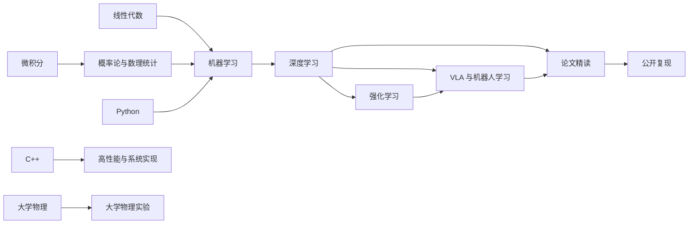

# 学习地图

这张图表达知识依赖，不代表固定学习顺序。课程页给出章节状态；只有通过详细笔记门槛的节点才进入正式导航。

## 建议使用方式

1. 在课程首页确认前置知识和“待整理”范围。
2. 阅读正式章节时，手推公式并完成自测，不把“看懂”当作“会用”。
3. 把不确定结论放入[未解决问题](questions.md)，把已确认错误记录到[错误簿](mistakes.md)。
4. 阅读论文时区分作者结论、可核实事实、本站解释与猜测。
5. 只有公开方法和白名单数据才能进入[复现记录](reproductions/index.md)。

