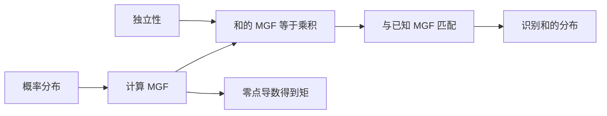

# MGF、常见分布与可加性

## 学习目标

完成本节后，应当能够从定义计算简单分布的矩母函数（moment-generating function, MGF），说明 MGF 存在时为何能生成矩，利用独立性求随机变量和的 MGF，并识别二项、Poisson、正态、Gamma 与卡方分布中的可加性。更重要的是，要知道这种方法何时不能用：MGF 可能在零点附近不存在，相同的低阶矩也不等于相同分布。

## 前置知识

需要掌握离散/连续随机变量、期望、独立性、概率质量函数与密度函数，以及幂级数在收敛区间内逐项求导的基本条件。Gamma 分布采用 shape–rate 参数化：形状参数为 $\alpha$，率参数为 $\beta$，因此均值为 $\alpha/\beta$；若教材使用 scale $\theta=1/\beta$，公式必须同步改写。

## 核心概念与符号表

随机变量 $X$ 的 MGF 定义为

$$
M_X(t)=\mathbb E[e^{tX}],
$$

其定义域是使期望有限的 $t$ 集合。只有当某个包含 $0$ 的开区间上 $M_X(t)<\infty$ 时，通常才说 MGF 在零点附近存在。符号 $X\sim\mathcal N(\mu,\sigma^2)$ 表示正态分布；$\operatorname{Pois}(\lambda)$ 表示 Poisson 分布；$\operatorname{Gamma}(\alpha,\beta)$ 使用 rate 参数；$X\perp Y$ 表示独立。

MGF 不只是“套表工具”。指数将所有非负整数次幂编码进同一个函数：

$$
e^{tX}=\sum_{k=0}^{\infty}\frac{t^kX^k}{k!}.
$$

若交换期望与无穷求和合法，则 $M_X(t)=\sum_k \mathbb E[X^k]t^k/k!$，所以零点处各阶导数给出原点矩。

## 公式来源与推导

### 从 MGF 生成矩

对 $M_X(t)=\mathbb E[e^{tX}]$ 求导，在可由支配收敛等条件保证“求导与期望交换”时，

$$
M_X^{(n)}(t)=\mathbb E[X^n e^{tX}],\qquad
M_X^{(n)}(0)=\mathbb E[X^n].
$$

于是 $M_X'(0)=\mathbb E[X]$，$M_X''(0)=\mathbb E[X^2]$，并有

$$
\operatorname{Var}(X)=M_X''(0)-[M_X'(0)]^2.
$$

直觉上，$t$ 改变指数权重：$t>0$ 更强调右尾，$t<0$ 更强调左尾。零点附近对 $t$ 的敏感度恰好记录不同阶的幂矩。

### 独立和为什么对应 MGF 相乘

若 $X$ 与 $Y$ 独立，则

$$
\begin{aligned}
M_{X+Y}(t)
&=\mathbb E[e^{t(X+Y)}]\\
&=\mathbb E[e^{tX}e^{tY}]\\
&=\mathbb E[e^{tX}]\,\mathbb E[e^{tY}]\\
&=M_X(t)M_Y(t).
\end{aligned}
$$

第三步是唯一真正使用独立性的地方。不独立时，$e^{tX}$ 与 $e^{tY}$ 通常也不独立，乘积期望不能拆开。若 MGF 在零点邻域存在并唯一确定分布，我们就可以把乘积与某个已知 MGF 对上，从而识别 $X+Y$ 的分布。

### 常见可加性

| 独立变量 | 单变量 MGF | 和的分布 | 必要条件 |
|---|---|---|---|
| $X_i\sim\operatorname{Bernoulli}(p)$ | $1-p+pe^t$ | $\sum_{i=1}^nX_i\sim\operatorname{Bin}(n,p)$ | 相同 $p$ 才是标准二项分布 |
| $X_i\sim\operatorname{Pois}(\lambda_i)$ | $\exp[\lambda_i(e^t-1)]$ | $\operatorname{Pois}(\sum_i\lambda_i)$ | 独立 |
| $X_i\sim\mathcal N(\mu_i,\sigma_i^2)$ | $\exp(\mu_i t+\sigma_i^2t^2/2)$ | $\mathcal N(\sum_i\mu_i,\sum_i\sigma_i^2)$ | 独立；联合正态下可推广到相关情形 |
| $X_i\sim\operatorname{Gamma}(\alpha_i,\beta)$ | $(\beta/(\beta-t))^{\alpha_i}$ | $\operatorname{Gamma}(\sum_i\alpha_i,\beta)$ | rate 必须相同 |
| $X_i\sim\chi^2_{\nu_i}$ | $(1-2t)^{-\nu_i/2}$ | $\chi^2_{\sum_i\nu_i}$ | 独立 |

Gamma 的“同率”条件容易漏掉。不同 rate 的 MGF 乘积是 $\prod_i(\beta_i/(\beta_i-t))^{\alpha_i}$，一般不能化成单个 Gamma MGF。

## 完整数值例子

设呼叫中心两个独立时段的来电数分别为 $X\sim\operatorname{Pois}(3)$、$Y\sim\operatorname{Pois}(5)$。求总来电 $S=X+Y$ 的分布、均值以及 $P(S=2)$。

由 Poisson MGF，

$$
M_S(t)=e^{3(e^t-1)}e^{5(e^t-1)}=e^{8(e^t-1)},
$$

因此 $S\sim\operatorname{Pois}(8)$，$\mathbb E[S]=8$。概率为

$$
P(S=2)=e^{-8}\frac{8^2}{2!}=32e^{-8}\approx 0.0107.
$$

也可以从卷积验证：

$$
P(S=2)=\sum_{k=0}^{2}P(X=k)P(Y=2-k)
=e^{-8}\left(\frac{5^2}{2}+3\cdot5+\frac{3^2}{2}\right)=32e^{-8}.
$$

MGF 给出分布族与参数，卷积则提供逐项概率的独立核验，两条路径相符。

## 图示与章节关系

本节连接前面的期望与独立性，并为后面的 Chernoff 界、中心极限定理、充分统计量与指数族做准备。特征函数 $\varphi_X(t)=\mathbb E[e^{itX}]$ 对所有随机变量都存在，能处理 MGF 不存在的重尾分布；累积量生成函数 $K_X(t)=\log M_X(t)$ 则把独立和的乘法变成加法。

## 常见错误、适用条件与反例

1. **看到“和”就相乘 MGF。** 必须先验证独立性。若 $Y=X$，则 $M_{X+Y}(t)=M_X(2t)$，通常不等于 $M_X(t)^2$。
2. **把 MGF 表当作无条件唯一标识。** 唯一性结论要求 MGF 在 $0$ 的邻域存在。对数正态分布的所有正整数矩存在，但 $t>0$ 时 MGF 发散。
3. **混用 Gamma 的 rate 与 scale。** 写参数化、定义域、均值三者之一还不够，必须一致写全。
4. **认为同均值同方差就是同分布。** Bernoulli、离散多点分布和连续分布都可能共享前两阶矩。
5. **忽略定义域。** 指数分布 $\operatorname{Exp}(\lambda)$ 的 MGF 是 $\lambda/(\lambda-t)$，只在 $t<\lambda$ 有限。

## 自测题与答案提示

1. 若 $X_i\sim\mathcal N(2,3)$ 独立，求 $\sum_{i=1}^4X_i$。提示：均值和方差分别相加，得到 $\mathcal N(8,12)$。
2. 独立的 $X\sim\operatorname{Gamma}(2,4)$ 与 $Y\sim\operatorname{Gamma}(3,4)$ 的和是什么？提示：共同 rate 为 $4$，shape 相加为 $5$。
3. 两个不独立但协方差为零的变量，是否可以直接相乘 MGF？提示：零协方差只限制二阶混合矩，不保证独立。
4. 为什么特征函数比 MGF 更普遍？提示：$|e^{itX}|=1$，所以期望总是存在。

## 参考资料

- StatLect, *Moment generating function*：定义、存在性和唯一性条件。
- Penn State STAT 414：常见分布、MGF 与独立和的课程材料。
- 任一使用本页公式的教材都应先核对 Gamma 参数化。

## 校对信息

最后校对：2026-07-21。掌握状态：复习中。已重算 Poisson 数值例子并核对 MGF 定义域；后续需补充特征函数与累积量的独立页面。

