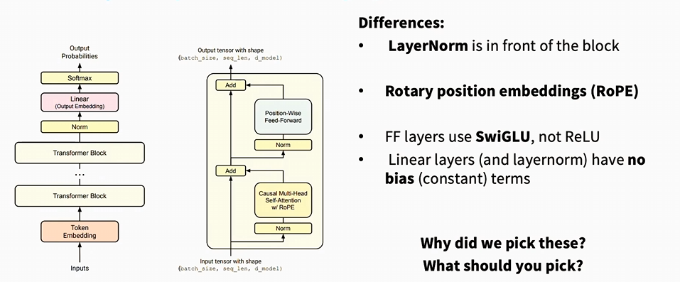
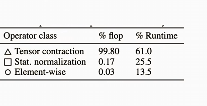
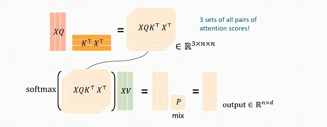
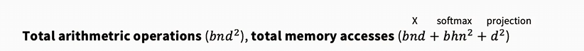
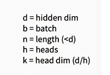

# Transformer

Transformer 本身有一个重要特点：

> **Self-Attention 本身不具有位置感知能力。**

也就是说，如果只把一组 token embedding 输入 Self-Attention，模型能够知道序列中有哪些 token，却不能天然知道这些 token 的先后顺序。

例如：

```text
我 喜欢 你
```

和：

```text
你 喜欢 我
```

包含的 token 相同，但是排列顺序不同。

如果不给模型提供位置信息，Self-Attention 本身不能完整地区分这两个序列。

因此，原始 Transformer 会在 Token Embedding 上加入正弦、余弦位置编码。

现在的大语言模型没有完全照搬原始 Transformer，而是采用了一种更加现代的 Transformer 架构。



从图中可以发现几个主要改动：

1. 从 Post-LayerNorm 改成 Pre-LayerNorm；
2. 从正弦、余弦位置编码改成 RoPE；
3. FFN 从 ReLU 改成 SwiGLU；
4. Linear 和 LayerNorm 去除了 bias；
5. 使用 Causal Multi-Head Self-Attention。

---

# 原始 Transformer

原始 Transformer 出自论文 *Attention Is All You Need*。

完整的原始 Transformer 是一个 Encoder-Decoder 架构：

```text
输入序列
   ↓
Encoder × N
   ↓
Encoder 输出
   ↓
Decoder × N
   ↓
输出序列
```

Encoder 负责理解输入序列。

Decoder 负责根据 Encoder 的输出，逐步生成目标序列。

## 原始 Encoder Block

一个原始 Encoder Block 包含：

```text
输入
 ↓
Multi-Head Self-Attention
 ↓
残差连接
 ↓
LayerNorm
 ↓
Feed-Forward Network
 ↓
残差连接
 ↓
LayerNorm
```

Attention 部分可以写成：

$$
Y
=
\operatorname{LayerNorm}
\left(
X+\operatorname{SelfAttention}(X)
\right)
$$

FFN 部分可以写成：

$$
Z
=
\operatorname{LayerNorm}
\left(
Y+\operatorname{FFN}(Y)
\right)
$$

## 原始 Decoder Block

原始 Decoder 比 Encoder 多了一个 Cross-Attention：

```text
输入
 ↓
Masked Self-Attention
 ↓
Add & Norm
 ↓
Cross-Attention
 ↓
Add & Norm
 ↓
Feed-Forward Network
 ↓
Add & Norm
```

其中：

- Masked Self-Attention：当前位置不能看到未来的 token；
- Cross-Attention：让 Decoder 读取 Encoder 的输出；
- Feed-Forward Network：分别处理每一个 token 的隐藏向量。

## 现代 Decoder-only Transformer

GPT、LLaMA 等大语言模型通常不再使用完整的 Encoder-Decoder，而是使用 Decoder-only 架构：

```text
Token IDs
   ↓
Token Embedding
   ↓
Transformer Block × N
   ↓
Final Norm
   ↓
Output Linear
   ↓
Logits
```

每个 Transformer Block 主要包含：

```text
Causal Multi-Head Self-Attention
Feed-Forward Network
```

因此，课程图片展示的是一种现代 Decoder-only Transformer，而不是完整的原始 Encoder-Decoder Transformer。

---

# Token Embedding

Tokenizer 会先把文本转换成 token id。

例如：

```text
我 喜欢 人工智能
```

可能被转换成：

```text
[125, 781, 2048]
```

这些数字只是 token 在词表中的编号，本身不能直接表示语义。

因此，需要使用 Token Embedding 将 token id 转换成连续向量。

假设：

- 词表大小为 `V`；
- 模型隐藏维度为 `d_model`。

模型内部有一个可学习的 Embedding 矩阵：

$$
E_{\text{token}}
\in
\mathbb{R}^{V\times d_{\text{model}}}
$$

这个矩阵的每一行对应一个 token 的向量。

如果第 `t` 个 token 的 id 是 `x_t`，那么它的 embedding 为：

$$
e_t
=
E_{\text{token}}[x_t]
$$

例如：

$$
V=50000
$$

$$
d_{\text{model}}=4096
$$

那么 Token Embedding 矩阵的形状是：

$$
E_{\text{token}}
\in
\mathbb{R}^{50000\times4096}
$$

如果 token id 是 256，就直接取矩阵的第 256 行：

$$
e_t
=
E_{\text{token}}[256]
$$

得到一个长度为 4096 的向量。

PyTorch 中可以写成：

```python
import torch
import torch.nn as nn

token_embedding = nn.Embedding(
    num_embeddings=50000,
    embedding_dim=4096,
)

token_ids = torch.tensor([
    [125, 781, 2048]
])

x = token_embedding(token_ids)

print(x.shape)
```

输出形状为：

```text
[batch_size, seq_len, d_model]
```

在这个例子中：

```text
[1, 3, 4096]
```

表示：

- batch 中有 1 条序列；
- 每条序列有 3 个 token；
- 每个 token 用 4096 个数字表示。

Embedding 从数学上也可以理解为 one-hot 向量乘 Embedding 矩阵：

$$
e_t
=
\operatorname{OneHot}(x_t)
E_{\text{token}}
$$

不过，实际实现不会真的构造一个很大的 one-hot 向量，而是直接从 Embedding 矩阵中查找对应行。

---

# Position Encoding

## 为什么需要位置编码

Token Embedding 只告诉模型：

> 这个 token 是什么。

它没有告诉模型：

> 这个 token 位于序列中的什么位置。

例如，同一个 token“我”无论出现在第一个位置还是第三个位置，查到的 Token Embedding 都相同。

因此，需要额外向模型提供位置信息。

原始 Transformer 的输入可以写成：

$$
X_t
=
E_{\text{token}}(x_t)
+
PE(t)
$$

其中：

- `E_token(x_t)` 表示第 `t` 个 token 的语义向量；
- `PE(t)` 表示第 `t` 个位置的位置编码。

有时也会把位置表示写成：

$$
X_t
=
E_{\text{token}}(x_t)
+
E_{\text{position}}(t)
$$

需要注意：

> 原始 Transformer 使用的是固定的正弦、余弦位置编码，而不是必须通过训练得到的位置 Embedding 矩阵。

但二者的作用相同，都是向模型提供位置信息。

---


# 正弦余弦位置编码

原始 Transformer 使用：

$$
PE(pos,2i)
=
\sin
\left(
\frac{pos}
{10000^{2i/d_{\text{model}}}}
\right)
$$

$$
PE(pos,2i+1)
=
\cos
\left(
\frac{pos}
{10000^{2i/d_{\text{model}}}}
\right)
$$

其中：

- `pos` 表示 token 在序列中的位置；
- `i` 表示第几组隐藏维度；
- `d_model` 表示模型隐藏维度；
- `2i` 表示偶数维度；
- `2i+1` 表示奇数维度。

隐藏维度会被两两分组：

```text
第 0、1 维为一组
第 2、3 维为一组
第 4、5 维为一组
……
```

一组位置编码可以写成：

$$
\begin{bmatrix}
\sin(pos\theta_i)\\
\cos(pos\theta_i)
\end{bmatrix}
$$

其中：

$$
\theta_i
=
10000^{-2i/d_{\text{model}}}
$$

不同维度组拥有不同的频率。

可以把它们理解为很多转速不同的时钟：

```text
第 0、1 维变化较快
第 2、3 维变化稍慢
第 4、5 维变化更慢
……
```

这样，不同位置会拥有不同的位置编码组合。

代码大致为：

```python
x = token_embedding(token_ids)

x = x + position_encoding[:seq_len]
```

---

# Self-Attention

在理解多头注意力之前，需要先理解单头注意力。

假设输入经过 Embedding 后得到：

$$
X
\in
\mathbb{R}^{B\times T\times d_{\text{model}}}
$$

其中：

- `B` 表示 batch size；
- `T` 表示序列长度；
- `d_model` 表示隐藏维度。

例如：

$$
X
\in
\mathbb{R}^{2\times5\times768}
$$

表示：

- batch 中有 2 条序列；
- 每条序列有 5 个 token；
- 每个 token 用 768 维向量表示。

---

## Q、K、V 是怎么得到的

输入 `X` 分别乘三个不同的可学习矩阵：

$$
Q
=
XW_Q
$$

$$
K
=
XW_K
$$

$$
V
=
XW_V
$$

其中：

$$
W_Q,W_K,W_V
\in
\mathbb{R}^{d_{\text{model}}\times d_{\text{model}}}
$$

所以，Q、K、V 都是由原来的隐藏向量 `X` 经过线性变换得到的。

不是每个 token 一开始就自带 Q、K、V，而是模型通过三个不同的矩阵，把同一个隐藏向量投影到三个不同的空间。

可以暂时理解为：

- Query：当前 token 想寻找什么；
- Key：当前 token 可以使用什么特征被其他 token 匹配；
- Value：如果其他 token 注意到当前 token，当前 token 实际提供什么信息。

例如句子：

```text
小明 把 苹果 给 小红
```

对于“给”这个 token：

- Query 可能表达“谁给、给了什么、给谁”；
- “小明”的 Key 可能表示它可能是动作执行者；
- “苹果”的 Key 可能表示它可能是动作涉及的物体；
- “小红”的 Key 可能表示它可能是动作接收者；
- 对应的 Value 保存真正需要传递的内容。

这些功能不是人工提前规定的，而是模型在训练过程中自己学习出来的。

---

## Query 和 Key 如何计算注意力分数

第 `i` 个 token 的 Query 与第 `j` 个 token 的 Key 做点积：

$$
s_{ij}
=
q_i^\top k_j
$$

点积越大，表示模型认为两个向量越匹配。

实际计算时还会除以：

$$
\sqrt{d_k}
$$

所以：

$$
s_{ij}
=
\frac{q_i^\top k_j}
{\sqrt{d_k}}
$$

这是为了防止维度很大时点积数值过大，使 Softmax 的输出过于极端。

将所有 Query 和 Key 一次性计算，可以写成：

$$
S
=
\frac{QK^\top}
{\sqrt{d_k}}
$$

注意力分数矩阵的形状为：

$$
S
\in
\mathbb{R}^{T\times T}
$$

其中第 `i` 行、第 `j` 列表示：

> 第 `i` 个 token 对第 `j` 个 token 的注意力分数。

---

## Softmax 的作用

注意力分数经过 Softmax：

$$
A
=
\operatorname{softmax}(S)
$$

对于第 `i` 个 token：

$$
a_{ij}
=
\frac{\exp(s_{ij})}
{\sum_{r=1}^{T}\exp(s_{ir})}
$$

因此：

$$
\sum_{j=1}^{T}a_{ij}
=
1
$$

假设某个 token 对其他 token 的分数为：

```text
[2.1, 0.2, 1.5, 0.4, 2.7]
```

经过 Softmax 后可能得到：

```text
[0.25, 0.04, 0.14, 0.05, 0.52]
```

这些值表示不同 token 对当前位置的重要程度。

---

## 为什么最后乘的是 V

注意力权重决定当前位置应该从每个 token 中获取多少信息。

$$
O
=
AV
$$

对于第 `i` 个 token：

$$
o_i
=
\sum_{j=1}^{T}
a_{ij}v_j
$$

例如：

$$
o_i
=
0.25v_1
+
0.04v_2
+
0.14v_3
+
0.05v_4
+
0.52v_5
$$

因此，Self-Attention 的本质是：

> 使用 Query 和 Key 计算不同 token 之间的相关程度，然后根据这些权重对 Value 做加权求和。

完整公式为：

$$
\operatorname{Attention}(Q,K,V)
=
\operatorname{softmax}
\left(
\frac{QK^\top}
{\sqrt{d_k}}
\right)V
$$

---

# Causal Self-Attention

在 Decoder-only 语言模型中，当前位置不能看到未来的 token。

例如，在根据：

```text
我 喜欢
```

预测下一个 token 时，模型不能提前看到后面的正确答案。

因此，需要加入 Causal Mask。

$$
M_{ij}
=
\begin{cases}
0, & j\le i\\
-\infty, & j>i
\end{cases}
$$

注意力公式变为：

$$
\operatorname{CausalAttention}(Q,K,V)
=
\operatorname{softmax}
\left(
\frac{QK^\top}
{\sqrt{d_k}}
+
M
\right)V
$$

由于：

$$
e^{-\infty}
=
0
$$

所以未来位置经过 Softmax 后，注意力权重为 0。

例如：

$$
M
=
\begin{bmatrix}
0&-\infty&-\infty&-\infty\\
0&0&-\infty&-\infty\\
0&0&0&-\infty\\
0&0&0&0
\end{bmatrix}
$$

这样：

- 第 1 个 token 只能看自己；
- 第 2 个 token 可以看前两个 token；
- 第 3 个 token 可以看前三个 token；
- 第 4 个 token 可以看前四个 token。

---

# 多头注意力机制

## 单头注意力的问题

如果只有一个注意力头，那么所有 token 之间的关系都需要在同一套 Q、K、V 投影空间中表达。

但是一句话中可能同时存在多种关系：

- 主语和谓语的关系；
- 动词和宾语的关系；
- 代词和被指代对象的关系；
- 相邻 token 的局部关系；
- 相距很远的长距离关系。

一个注意力头只能产生一张主要的注意力矩阵：

$$
A
\in
\mathbb{R}^{T\times T}
$$

不同类型的关系可能会互相干扰。

因此，Transformer 使用多个注意力头，让不同头在不同的投影空间中学习不同的关系。

---

## 每个注意力头都有自己的投影矩阵

假设：

$$
d_{\text{model}}
=
768
$$

注意力头数量为：

$$
H
=
12
$$

那么每个注意力头的维度为：

$$
d_{\text{head}}
=
\frac{d_{\text{model}}}{H}
$$

代入数值得到：

$$
d_{\text{head}}
=
\frac{768}{12}
=
64
$$

理论上，第 `h` 个注意力头拥有自己的矩阵：

$$
W_Q^{(h)}
\in
\mathbb{R}^{768\times64}
$$

$$
W_K^{(h)}
\in
\mathbb{R}^{768\times64}
$$

$$
W_V^{(h)}
\in
\mathbb{R}^{768\times64}
$$

第 `h` 个注意力头计算：

$$
Q^{(h)}
=
XW_Q^{(h)}
$$

$$
K^{(h)}
=
XW_K^{(h)}
$$

$$
V^{(h)}
=
XW_V^{(h)}
$$

然后：

$$
\operatorname{head}_h
=
\operatorname{softmax}
\left(
\frac{
Q^{(h)}
\left(K^{(h)}\right)^\top
}
{\sqrt{d_{\text{head}}}}
+
M
\right)
V^{(h)}
$$

不同注意力头的投影矩阵参数不同，因此可以学习不同的匹配规则。

例如，训练之后可能出现：

```text
Head 1：倾向于关注相邻 token
Head 2：倾向于关注主语
Head 3：倾向于关注宾语
Head 4：倾向于处理代词指代
Head 5：倾向于处理长距离依赖
```

不过这些功能不是人工指定的，而是训练中自己形成的。

---

## 多头注意力的张量形状

假设：

```text
B = 2
T = 5
d_model = 12
num_heads = 3
head_dim = 4
```

输入为：

$$
X
:
[2,5,12]
$$

计算 Q、K、V 后：

$$
Q
:
[2,5,12]
$$

$$
K
:
[2,5,12]
$$

$$
V
:
[2,5,12]
$$

然后把最后的 12 个维度拆成：

$$
12
=
3\times4
$$

得到：

$$
Q
:
[2,3,5,4]
$$

$$
K
:
[2,3,5,4]
$$

$$
V
:
[2,3,5,4]
$$

这里的维度顺序为：

```text
[batch_size, num_heads, seq_len, head_dim]
```

计算 Q 和 K 的矩阵乘法：

$$
QK^\top
$$

得到：

$$
S
:
[2,3,5,5]
$$

表示：

- batch 中有 2 条序列；
- 每条序列有 3 个注意力头；
- 每个注意力头都有一张 5 × 5 的注意力矩阵。

Softmax 后：

$$
A
:
[2,3,5,5]
$$

然后乘 V：

$$
AV
:
[2,3,5,4]
$$

得到每个注意力头的输出。

---

## 多个注意力头如何合并

第 `h` 个注意力头的输出为：

$$
\operatorname{head}_h
\in
\mathbb{R}^{T\times d_{\text{head}}}
$$

将所有注意力头沿最后一个维度拼接：

$$
\operatorname{Concat}
\left(
\operatorname{head}_1,
\operatorname{head}_2,
\ldots,
\operatorname{head}_H
\right)
$$

由于：

$$
Hd_{\text{head}}
=
d_{\text{model}}
$$

拼接后维度恢复成：

$$
T\times d_{\text{model}}
$$

然后再乘一个输出矩阵：

$$
O
=
\operatorname{Concat}
\left(
\operatorname{head}_1,
\ldots,
\operatorname{head}_H
\right)
W_O
$$

其中：

$$
W_O
\in
\mathbb{R}^{d_{\text{model}}\times d_{\text{model}}}
$$

`W_O` 的作用是把不同注意力头提取出来的信息进一步混合。

完整公式为：

$$
\operatorname{MultiHead}(Q,K,V)
=
\operatorname{Concat}
\left(
\operatorname{head}_1,
\ldots,
\operatorname{head}_H
\right)
W_O
$$


## 多头注意力的作用

多头注意力不是简单重复计算相同的东西。

它的作用是：

> 使用多组不同的 Q、K、V 投影，在多个不同的子空间中，同时寻找不同类型的 token 关系。

同一个 token 可以同时从多种关系中获得信息。

例如，对代词“它”：

```text
Head 1：关注它前面最接近的名词
Head 2：关注句子的主语
Head 3：关注与它相关的动作
Head 4：关注更远处的上下文
```

最后，多个注意力头的结果被拼接，再通过输出矩阵进行混合。

---

# LayerNorm

LayerNorm 全称为 Layer Normalization。

它的作用不是进行 token 之间的信息传递，而是：

> 对每个 token 的隐藏向量进行数值归一化，使不同层输入的数值尺度更加稳定。

---

## LayerNorm 在哪个维度计算

假设：

$$
X
\in
\mathbb{R}^{B\times T\times d_{\text{model}}}
$$

LayerNorm 沿最后一个维度计算，也就是沿 `d_model` 计算。

例如：

$$
X
:
[2,5,768]
$$

这表示一共有：

$$
2\times5
=
10
$$

个 token 向量。

每个 token 向量的长度为 768。

LayerNorm 会对这 10 个长度为 768 的向量分别进行归一化。

它不会把不同 token 混在一起，也不会把不同 batch 样本混在一起。

---

## LayerNorm 的数学公式

对于某个 token 的隐藏向量：

$$
x
=
(x_1,x_2,\ldots,x_d)
$$

先计算均值：

$$
\mu
=
\frac{1}{d}
\sum_{i=1}^{d}x_i
$$

再计算方差：

$$
\sigma^2
=
\frac{1}{d}
\sum_{i=1}^{d}
(x_i-\mu)^2
$$

然后标准化：

$$
\hat{x}_i
=
\frac{x_i-\mu}
{\sqrt{\sigma^2+\epsilon}}
$$

最后使用可学习参数进行缩放和平移：

$$
y_i
=
\gamma_i\hat{x}_i+\beta_i
$$

其中：

- `gamma` 是可学习的缩放参数；
- `beta` 是可学习的平移参数；
- `epsilon` 是一个很小的数，用来防止除以 0。

---

## LayerNorm 的具体例子

假设：

$$
x
=
[2,4,6]
$$

均值为：

$$
\mu
=
\frac{2+4+6}{3}
=
4
$$

方差为：

$$
\sigma^2
=
\frac{
(2-4)^2
+
(4-4)^2
+
(6-4)^2
}{3}
$$

$$
\sigma^2
=
\frac{4+0+4}{3}
=
\frac{8}{3}
$$

标准差约为：

$$
\sigma
\approx
1.63
$$

归一化后：

$$
\hat{x}
\approx
[-1.22,0,1.22]
$$

原来的数值范围是 2 到 6。

归一化后被整理到了一个更加稳定的范围。

---

## 为什么 Transformer 需要 LayerNorm

Transformer 中，隐藏向量会反复经过：

- Q、K、V 线性投影；
- Attention 加权；
- Attention 输出投影；
- FFN；
- 残差相加。

如果不进行控制，随着层数增加，隐藏值可能越来越大或者越来越小。

这会造成：

1. Q 和 K 的点积过大；
2. Softmax 变得过于极端；
3. 某个注意力权重接近 1，其他权重接近 0；
4. 梯度爆炸或者梯度消失；
5. 深层模型难以训练。

LayerNorm 会在进入重要模块之前或者之后，重新整理隐藏向量的数值尺度。

可以把 LayerNorm 理解为：

> 在进入下一次复杂计算前，先把每个 token 的隐藏向量整理到相对稳定的数值范围。

---

## LayerNorm 会不会删除信息

LayerNorm 会去掉向量整体的均值和尺度。

例如：

$$
[2,4,6]
$$

和：

$$
[20,40,60]
$$

归一化后的结果会比较接近。

但是，LayerNorm 保留了不同维度之间的相对关系：

```text
第一维最小
第二维居中
第三维最大
```

同时 LayerNorm 还有可学习参数：

$$
\gamma
$$

$$
\beta
$$

模型可以重新学习需要的缩放和平移。

所以 LayerNorm 并不是清除所有信息，而是对数值尺度进行整理。

---

# Post-LayerNorm 改成 Pre-LayerNorm

## 原始 Post-LayerNorm

原始 Transformer 中，LayerNorm 放在 Attention 或 FFN 与残差相加之后。

Attention 部分：

$$
Y
=
\operatorname{LayerNorm}
\left(
X+\operatorname{Attention}(X)
\right)
$$

FFN 部分：

$$
Z
=
\operatorname{LayerNorm}
\left(
Y+\operatorname{FFN}(Y)
\right)
$$

结构为：

```text
x
│
├───────────────┐
│               ↓
│           Attention
│               ↓
└────────────── Add
                ↓
            LayerNorm
```

因为 LayerNorm 位于子模块和残差相加之后，所以叫 Post-LayerNorm。

代码为：

```python
def forward(self, x):
    x = self.norm1(
        x + self.attention(x)
    )

    x = self.norm2(
        x + self.ffn(x)
    )

    return x
```

---

## 现代 Pre-LayerNorm

现代 Transformer 通常把 LayerNorm 放到 Attention 和 FFN 前面。

Attention 部分：

$$
Y
=
X
+
\operatorname{Attention}
\left(
\operatorname{LayerNorm}(X)
\right)
$$

FFN 部分：

$$
Z
=
Y
+
\operatorname{FFN}
\left(
\operatorname{LayerNorm}(Y)
\right)
$$

结构为：

```text
x
│
├─────────────────┐
│                 ↓
│             LayerNorm
│                 ↓
│             Attention
│                 ↓
└─────────────── Add
```

因为 LayerNorm 位于子模块前面，所以叫 Pre-LayerNorm。

代码为：

```python
def forward(self, x):
    x = x + self.attention(
        self.norm1(x)
    )

    x = x + self.ffn(
        self.norm2(x)
    )

    return x
```

最核心的结构为：

```python
x = x + attention(norm1(x))

x = x + ffn(norm2(x))
```

---

## Pre-LayerNorm 为什么更容易训练

对于 Pre-LayerNorm：

$$
X_{l+1}
=
X_l
+
F
\left(
\operatorname{LN}(X_l)
\right)
$$

对 `X_l` 求导：

$$
\frac{\partial X_{l+1}}
{\partial X_l}
=
I
+
\frac{
\partial
F
\left(
\operatorname{LN}(X_l)
\right)
}
{\partial X_l}
$$

这里存在一个恒等项：

$$
I
$$

这意味着梯度可以沿着残差连接直接传播：

```text
X_l → X_(l+1)
```

即使 Attention 或 FFN 分支的梯度比较复杂，仍然存在一条直接的梯度路径。

因此，Pre-LayerNorm 通常具有以下优点：

- 深层模型更容易训练；
- 梯度传播更加稳定；
- 对学习率更加稳定；
- 不容易出现严重的梯度消失。

---

## 为什么最后还需要 Final Norm

Pre-LayerNorm 每一层最后没有执行 LayerNorm：

$$
X_{l+1}
=
X_l
+
F
\left(
\operatorname{LN}(X_l)
\right)
$$

因此，经过所有 Transformer Block 后，通常还需要执行一次最终归一化：

$$
H
=
\operatorname{FinalNorm}(X_N)
$$

然后再送入输出层：

$$
\text{logits}
=
HW_{\text{vocab}}
$$

所以现代 Decoder-only Transformer 顶部通常是：

```text
Transformer Block × N
        ↓
     Final Norm
        ↓
    Output Linear
```

---

# Rotary Position Embedding

原始 Transformer 将位置编码直接加到 Token Embedding 上：

$$
X_t
=
E_{\text{token}}(x_t)
+
PE(t)
$$

现代大语言模型经常使用 RoPE。

RoPE 全称为：

```text
Rotary Position Embedding
```

也就是旋转位置编码。

RoPE 不再把位置向量直接加到输入 `X` 上，而是：

> 先计算 Q、K、V，然后根据 token 的位置对 Q 和 K 进行旋转。

---

## RoPE 的执行顺序

现代 Pre-LayerNorm Attention 的顺序为：

```text
X
↓
LayerNorm
↓
Q、K、V 投影
↓
拆成多个注意力头
↓
对 Q、K 使用 RoPE
↓
计算注意力分数
```

首先：

$$
X_{\text{norm}}
=
\operatorname{LayerNorm}(X)
$$

然后：

$$
Q
=
X_{\text{norm}}W_Q
$$

$$
K
=
X_{\text{norm}}W_K
$$

$$
V
=
X_{\text{norm}}W_V
$$

再对 Q 和 K 使用 RoPE：

$$
Q'
=
\operatorname{RoPE}(Q)
$$

$$
K'
=
\operatorname{RoPE}(K)
$$

最后计算：

$$
A
=
\operatorname{softmax}
\left(
\frac{Q'K'^\top}
{\sqrt{d_{\text{head}}}}
+
M
\right)
$$

$$
O
=
AV
$$

因此，RoPE 是在乘完 `W_Q` 和 `W_K`，得到 Q 和 K 之后进行的。

通常不会对 V 使用 RoPE。

---

## RoPE 的二维旋转

假设某个 token 位于序列位置 `p`，它在某一个注意力头中的 Query 为：

$$
q_p
=
\begin{bmatrix}
q_0\\
q_1\\
q_2\\
q_3\\
q_4\\
q_5\\
q_6\\
q_7
\end{bmatrix}
$$

假设每个注意力头的维度为：

$$
d_{\text{head}}
=
8
$$

RoPE 不会把整个 8 维向量当成一个整体进行八维旋转，而是把最后一个维度两两分组：

```text
第 0 组：(q0, q1)
第 1 组：(q2, q3)
第 2 组：(q4, q5)
第 3 组：(q6, q7)
```

第 `i` 个二维维度组为：

$$
\begin{bmatrix}
q_{2i}\\
q_{2i+1}
\end{bmatrix}
$$

这里的 `i` 是**二维维度组的编号**，不是某一个单独隐藏维度的编号。

当：

$$
d_{\text{head}}
=
8
$$

时，一共有：

$$
\frac{d_{\text{head}}}{2}
=
4
$$

个二维组，所以：

$$
i
=
0,1,2,3
$$

对应关系为：

| 维度组编号 `i` | 第一个维度 `2i` | 第二个维度 `2i+1` | 实际维度组 |
|---:|---:|---:|---|
| 0 | 0 | 1 | $(q_0,q_1)$ |
| 1 | 2 | 3 | $(q_2,q_3)$ |
| 2 | 4 | 5 | $(q_4,q_5)$ |
| 3 | 6 | 7 | $(q_6,q_7)$ |

因此，可以理解为：

> RoPE 把每个注意力头中的相邻两个隐藏维度分成一组，然后在每组内部进行二维旋转。

这里不是把 token 进行分类，也不是把多个 token 两两配对，而是把**同一个 token 的 Query 或 Key 向量中的隐藏维度**两两配对。

---

## 每组的基础旋转频率

对于第 `i` 个二维维度组，RoPE 先定义一个基础旋转频率：

$$
\theta_i
=
10000^{-2i/d_{\text{head}}}
$$

当模型结构和 `d_head` 已经确定后，每一组对应的：

$$
\theta_i
$$

就是固定的。

它不是根据 token 的内容计算出来的，也不是每次前向传播随机变化的。

对于：

$$
d_{\text{head}}
=
8
$$

有：

$$
\theta_0
=
10000^0
=
1
$$

$$
\theta_1
=
10000^{-2/8}
=
10000^{-1/4}
=
0.1
$$

$$
\theta_2
=
10000^{-4/8}
=
10000^{-1/2}
=
0.01
$$

$$
\theta_3
=
10000^{-6/8}
=
10000^{-3/4}
=
0.001
$$

因此，四个二维维度组的基础频率分别为：

```text
第 0 组：θ0 = 1
第 1 组：θ1 = 0.1
第 2 组：θ2 = 0.01
第 3 组：θ3 = 0.001
```

这些数值表示的是每向后移动一个位置，该二维维度组额外旋转多少弧度。

越靠前的维度组，频率通常越高，随位置变化越快；越靠后的维度组，频率越低，随位置变化越慢。

可以把它们理解成转速不同的时钟。

---

## token 的位置决定实际旋转角度

对于位置为 `p` 的 token，第 `i` 个二维维度组的实际旋转角度为：

$$
p\theta_i
$$

这里包含两个因素：

- `p`：当前 token 位于序列中的第几个位置；
- `i`：当前处理的是第几个二维维度组。

因此，只要下面两个条件相同：

1. token 的位置 `p` 相同；
2. 二维维度组编号 `i` 相同；

那么对应的旋转角度：

$$
p\theta_i
$$

就是相同的。

例如，所有位于位置：

$$
p=2
$$

的 token，在第 `i=1` 个二维维度组中，使用的角度都是：

$$
2\theta_1
$$

在刚才的例子中：

$$
\theta_1
=
0.1
$$

所以旋转角度为：

$$
2\theta_1
=
2\times0.1
=
0.2
$$

这里的角度单位通常是弧度。

对于位置 `p=2` 的 token，四个二维维度组分别旋转：

$$
2\theta_0
=
2
$$

$$
2\theta_1
=
0.2
$$

$$
2\theta_2
=
0.02
$$

$$
2\theta_3
=
0.002
$$

所以，同一个 token 的不同维度组不会旋转相同的角度。

需要区分两件事：

- 同一位置、同一维度组，旋转角度相同；
- 同一位置、不同维度组，因为 `theta_i` 不同，所以旋转角度不同。

而且，即使两个 token 使用相同的旋转角度，它们旋转后的结果也不一定相同。

假设两个 token 的 Query 分别为：

$$
q_a
\neq
q_b
$$

即使它们位于同一个位置，并且都乘同一个旋转矩阵：

$$
q'_a
=
R_pq_a
$$

$$
q'_b
=
R_pq_b
$$

通常仍然有：

$$
q'_a
\neq
q'_b
$$

因为 RoPE 规定的是“旋转多少角度”，而 Query 和 Key 原本的内容仍然由 token 和上下文决定。

---

## 单个二维维度组的旋转矩阵

对于位置 `p`，第 `i` 组维度的旋转角度为：

$$
p\theta_i
$$

对应的二维旋转矩阵为：

$$
R(p\theta_i)
=
\begin{bmatrix}
\cos(p\theta_i)
&
-\sin(p\theta_i)
\\
\sin(p\theta_i)
&
\cos(p\theta_i)
\end{bmatrix}
$$

第 `i` 组 Query 经过旋转后：

$$
\begin{bmatrix}
q'_{2i}\\
q'_{2i+1}
\end{bmatrix}
=
R(p\theta_i)
\begin{bmatrix}
q_{2i}\\
q_{2i+1}
\end{bmatrix}
$$

展开后：

$$
q'_{2i}
=
q_{2i}\cos(p\theta_i)
-
q_{2i+1}\sin(p\theta_i)
$$

$$
q'_{2i+1}
=
q_{2i}\sin(p\theta_i)
+
q_{2i+1}\cos(p\theta_i)
$$

例如，第 0 个二维维度组为：

$$
\begin{bmatrix}
q'_0\\
q'_1
\end{bmatrix}
=
R(p\theta_0)
\begin{bmatrix}
q_0\\
q_1
\end{bmatrix}
$$

第 1 个二维维度组为：

$$
\begin{bmatrix}
q'_2\\
q'_3
\end{bmatrix}
=
R(p\theta_1)
\begin{bmatrix}
q_2\\
q_3
\end{bmatrix}
$$

后面的维度组同理。

Key 使用完全相同的位置旋转规则：

$$
\begin{bmatrix}
k'_{2i}\\
k'_{2i+1}
\end{bmatrix}
=
R(p\theta_i)
\begin{bmatrix}
k_{2i}\\
k_{2i+1}
\end{bmatrix}
$$

同一位置的 Query 和 Key 使用相同的旋转角度，但由于原始的 Query 和 Key 向量不同，旋转后的结果也通常不同。

---

## 把多个二维旋转矩阵拼成整体矩阵

前面是分别处理每一个二维维度组。

从整体上看，可以把所有二维旋转矩阵放在一个大矩阵的对角线上，构成一个**分块对角矩阵**。

当：

$$
d_{\text{head}}
=
8
$$

时，位置 `p` 对应的整体旋转矩阵为：

$$
R_p
=
\begin{bmatrix}
R(p\theta_0) & 0 & 0 & 0\\
0 & R(p\theta_1) & 0 & 0\\
0 & 0 & R(p\theta_2) & 0\\
0 & 0 & 0 & R(p\theta_3)
\end{bmatrix}
$$

这里每一个：

$$
R(p\theta_i)
$$

都是一个：

$$
2\times2
$$

的旋转矩阵，所以整体的：

$$
R_p
$$

是一个：

$$
8\times8
$$

的矩阵。

将它完全展开可以写成：

$$
R_p
=
\begin{bmatrix}
\cos(p\theta_0) & -\sin(p\theta_0) & 0 & 0 & 0 & 0 & 0 & 0\\
\sin(p\theta_0) & \cos(p\theta_0) & 0 & 0 & 0 & 0 & 0 & 0\\
0 & 0 & \cos(p\theta_1) & -\sin(p\theta_1) & 0 & 0 & 0 & 0\\
0 & 0 & \sin(p\theta_1) & \cos(p\theta_1) & 0 & 0 & 0 & 0\\
0 & 0 & 0 & 0 & \cos(p\theta_2) & -\sin(p\theta_2) & 0 & 0\\
0 & 0 & 0 & 0 & \sin(p\theta_2) & \cos(p\theta_2) & 0 & 0\\
0 & 0 & 0 & 0 & 0 & 0 & \cos(p\theta_3) & -\sin(p\theta_3)\\
0 & 0 & 0 & 0 & 0 & 0 & \sin(p\theta_3) & \cos(p\theta_3)
\end{bmatrix}
$$

于是，位置 `p` 的整个 Query 向量可以一次性写成：

$$
q'_p
=
R_pq_p
$$

Key 同理：

$$
k'_p
=
R_pk_p
$$

所以，式子：

$$
q'_m
=
R_mq_m
$$

中的：

$$
R_m
$$

并不是某一个单独的二维旋转矩阵，而是由这个位置下所有二维维度组的旋转矩阵共同组成的整体分块对角矩阵。

对于位置 `m`：

```text
第 0 组旋转 mθ0
第 1 组旋转 mθ1
第 2 组旋转 mθ2
第 3 组旋转 mθ3
```

把这四个二维旋转操作放在一起，就得到整体的：

$$
R_m
$$

因此，你可以按照下面的过程理解 RoPE：

```text
一个 token 的某个注意力头向量
            ↓
将 head_dim 两两分组
            ↓
第 i 组使用固定频率 θi
            ↓
位置 p 决定实际角度 pθi
            ↓
每组分别进行二维旋转
            ↓
重新拼回完整的 head_dim 维向量
```

---

## 不同注意力头如何使用 RoPE

假设有多个注意力头，并且每个头都有：

$$
d_{\text{head}}
=
8
$$

在标准 RoPE 中，每个注意力头都会在自己的 8 个隐藏维度内部进行相同形式的两两分组：

```text
Head 0：(q0, q1)、(q2, q3)、(q4, q5)、(q6, q7)
Head 1：(q0, q1)、(q2, q3)、(q4, q5)、(q6, q7)
Head 2：(q0, q1)、(q2, q3)、(q4, q5)、(q6, q7)
……
```

这里每个头中的 `q0`、`q1` 都是这个头内部的局部维度编号，并不是所有注意力头共用同一组 Query 数值。

对于同一个 token 位置 `p`，不同注意力头通常使用相同的频率表：

$$
\theta_0,
\theta_1,
\ldots,
\theta_{d_{\text{head}}/2-1}
$$

所以它们使用相同的旋转角度规则。

但是不同注意力头拥有不同的 Q、K 投影结果，因此旋转后的向量和最终的注意力分数仍然不同。

可以理解为：

> 不同注意力头使用同一套位置坐标规则，但每个头在这套坐标规则中旋转的是不同的内容向量。

---

## 二维旋转改变了什么

假设某一组 Query 为：

$$
q
=
\begin{bmatrix}
1\\
0
\end{bmatrix}
$$

旋转 90 度后：

$$
q'
=
\begin{bmatrix}
0\\
1
\end{bmatrix}
$$

旋转前后的向量长度不变：

$$
\lVert q'\rVert
=
\lVert q\rVert
$$

发生改变的是向量的方向，而不是向量的长度。

这来自旋转矩阵的正交性质：

$$
R_p^\top R_p
=
I
$$

因此：

$$
\lVert R_pq_p\rVert^2
=
q_p^\top R_p^\top R_pq_p
=
q_p^\top q_p
$$

所以 RoPE 不会单纯通过放大或缩小 Q、K 的长度来表示位置，而是通过改变它们在不同二维子空间中的方向来编码位置。

RoPE 的作用可以理解为：

> 根据 token 的位置，调整 Q 和 K 在不同二维子空间中的方向，同时保留每个二维组以及整个向量的长度。

---

## 数学写法和实际代码的区别

数学上，为了方便推导，可以写成：

$$
q'_p
=
R_pq_p
$$

$$
k'_p
=
R_pk_p
$$

但是实际代码通常不会真的创建一个完整的：

$$
d_{\text{head}}
\times
d_{\text{head}}
$$

大矩阵。

因为这个大矩阵的大部分元素都是 0，真正有用的只是每个二维旋转块中的正弦和余弦值。

所以代码通常直接取出偶数维和奇数维：

```python
x_even = x[..., 0::2]
x_odd = x[..., 1::2]
```

然后计算：

```python
rotated_even = x_even * cos - x_odd * sin
rotated_odd  = x_even * sin + x_odd * cos
```

最后再把它们交错拼回原来的维度顺序。

所以：

> `q'_p = R_p q_p` 是便于理解和证明的整体数学写法；逐组计算正弦、余弦是实际程序中更高效的等价实现。

---

# RoPE 为什么能表示相对位置

假设位置 `m` 的 Query 为：

$$
q'_m
=
R_mq_m
$$

位置 `n` 的 Key 为：

$$
k'_n
=
R_nk_n
$$

其中：

- `q_m` 是位置 `m` 原本的 Query；
- `k_n` 是位置 `n` 原本的 Key；
- `R_m` 是位置 `m` 对应的旋转；
- `R_n` 是位置 `n` 对应的旋转。

计算旋转后的点积：

$$
(q'_m)^\top k'_n
=
(R_mq_m)^\top(R_nk_n)
$$

根据矩阵转置规则：

$$
(AB)^\top
=
B^\top A^\top
$$

得到：

$$
(q'_m)^\top k'_n
=
q_m^\top R_m^\top R_nk_n
$$

对于旋转矩阵：

$$
R_m^\top
=
R_{-m}
$$

因此：

$$
R_m^\top R_n
=
R_{-m}R_n
$$

$$
R_m^\top R_n
=
R_{n-m}
$$

最终得到：

$$
(q'_m)^\top k'_n
=
q_m^\top R_{n-m}k_n
$$

其中，位置相关的部分只剩下：

$$
n-m
$$

也就是两个 token 的相对距离。

---

## 更直观的理解

假设每移动一个位置就旋转 30 度。

Query 位于位置 2，那么它旋转：

$$
2\times30^\circ
=
60^\circ
$$

Key 位于位置 5，那么它旋转：

$$
5\times30^\circ
=
150^\circ
$$

两个向量之间的位置角度差为：

$$
150^\circ-60^\circ
=
90^\circ
$$

也就是：

$$
(5-2)\times30^\circ
=
90^\circ
$$

如果两个位置一起向后移动：

```text
位置 2 和位置 5
变成
位置 12 和位置 15
```

那么角度差仍然为：

$$
(15-12)\times30^\circ
=
90^\circ
$$

因此，虽然 RoPE 使用绝对位置决定每个 Q 和 K 旋转多少角度，但是 Q 和 K 做点积时，位置带来的影响只依赖二者的相对距离。

需要注意：

> Attention 分数并不是只由相对位置决定。

Attention 分数还取决于：

$$
q_m
$$

$$
k_n
$$

也就是两个 token 的内容。

更准确地说：

> Attention 分数同时依赖 token 内容和位置信息，其中位置部分只依赖两个 token 的相对距离。

---

## RoPE 的代码实现

```python
def apply_rope(x, cos, sin):
    # x: [B, H, T, head_dim]

    x_even = x[..., 0::2]
    x_odd = x[..., 1::2]

    rotated_even = (
        x_even * cos
        - x_odd * sin
    )

    rotated_odd = (
        x_even * sin
        + x_odd * cos
    )

    x_rotated = torch.stack(
        [rotated_even, rotated_odd],
        dim=-1,
    )

    return x_rotated.flatten(-2)
```

使用过程：

```python
q = q_proj(x)
k = k_proj(x)
v = v_proj(x)

q = split_heads(q)
k = split_heads(k)
v = split_heads(v)

q = apply_rope(q, cos, sin)
k = apply_rope(k, cos, sin)

scores = q @ k.transpose(-1, -2)
```

完整过程为：

1. 输入 `X` 先经过 LayerNorm；
2. `X` 分别乘 `W_Q`、`W_K`、`W_V`；
3. 得到 Q、K、V；
4. 将 Q、K、V 拆成多个注意力头；
5. 对每个头的 Q、K 最后一个维度两两配对；
6. 根据 token 的位置进行旋转；
7. 使用旋转后的 Q、K 计算注意力分数；
8. 使用注意力权重对 V 加权求和。

---

# 激活函数和 FFN 的改动

## 原始 Transformer 的 ReLU FFN

原始 Transformer 的 Feed-Forward Network 为：

$$
\operatorname{FFN}(x)
=
\operatorname{ReLU}
\left(
xW_1+b_1
\right)
W_2+b_2
$$

其中：

$$
W_1
\in
\mathbb{R}^{d_{\text{model}}\times d_{\text{ff}}}
$$

$$
W_2
\in
\mathbb{R}^{d_{\text{ff}}\times d_{\text{model}}}
$$

通常：

$$
d_{\text{ff}}
\approx
4d_{\text{model}}
$$

例如：

$$
d_{\text{model}}
=
768
$$

那么：

$$
d_{\text{ff}}
=
3072
$$

形状变化为：

```text
[B, T, 768]
      ↓ W1
[B, T, 3072]
      ↓ ReLU
[B, T, 3072]
      ↓ W2
[B, T, 768]
```

ReLU 的公式为：

$$
\operatorname{ReLU}(x)
=
\max(0,x)
$$

也就是：

- 正数保留；
- 负数直接变成 0。

代码为：

```python
class OriginalFFN(nn.Module):
    def __init__(self, d_model, d_ff):
        super().__init__()

        self.linear1 = nn.Linear(
            d_model,
            d_ff,
            bias=True,
        )

        self.linear2 = nn.Linear(
            d_ff,
            d_model,
            bias=True,
        )

    def forward(self, x):
        x = self.linear1(x)
        x = torch.relu(x)
        x = self.linear2(x)

        return x
```

---

# SwiGLU

现代 Transformer 经常使用 SwiGLU 替代 ReLU FFN。

SwiGLU 包含三个线性投影：

- `gate_proj`
- `up_proj`
- `down_proj`

首先计算门控分支：

$$
g
=
\operatorname{SiLU}
\left(
xW_{\text{gate}}
\right)
$$

再计算内容分支：

$$
u
=
xW_{\text{up}}
$$

然后进行逐元素乘法：

$$
h
=
g\odot u
$$

最后通过降维矩阵：

$$
y
=
hW_{\text{down}}
$$

完整公式为：

$$
\operatorname{SwiGLU}(x)
=
\left[
\operatorname{SiLU}
\left(
xW_{\text{gate}}
\right)
\odot
\left(
xW_{\text{up}}
\right)
\right]
W_{\text{down}}
$$

其中：

$$
\odot
$$

表示逐元素乘法。

---

## gate_proj 和 up_proj 是并行的

SwiGLU 不是下面这种串行结构：

```text
x
→ gate_proj
→ SiLU
→ up_proj
→ down_proj
```

而是两个并行分支：

```text
                    ┌─ gate_proj ─ SiLU ─┐
输入 x ─────────────┤                    × ─ down_proj ─ 输出
                    └─ up_proj ──────────┘
```

也就是：

```text
输入 x
  ├─→ gate_proj → SiLU ─┐
  │                      × → down_proj
  └─→ up_proj ──────────┘
```

两个升维矩阵都直接接收同一个输入 `x`。

---

## SiLU

SiLU 定义为：

$$
\operatorname{SiLU}(x)
=
x\sigma(x)
$$

其中 Sigmoid 为：

$$
\sigma(x)
=
\frac{1}
{1+e^{-x}}
$$

所以：

$$
\operatorname{SiLU}(x)
=
\frac{x}
{1+e^{-x}}
$$

与 ReLU 相比：

$$
\operatorname{ReLU}(x)
=
\max(0,x)
$$

ReLU 会将所有负值直接变成 0。

SiLU 是更加平滑的函数：

- 输入很大且为正数时，输出接近输入；
- 输入接近 0 时，输出平滑变化；
- 输入为负数时，不会全部直接变成 0；
- 整个函数连续并且可导。

---

# SwiGLU 如何实现门控

只看下面的计算：

$$
\operatorname{SiLU}
\left(
xW_{\text{gate}}
\right)
$$

它确实只是一次线性变换和一次激活函数。

真正实现门控的关键，是它会与另一个分支进行逐元素乘法：

$$
h
=
\operatorname{SiLU}
\left(
xW_{\text{gate}}
\right)
\odot
\left(
xW_{\text{up}}
\right)
$$

其中，内容分支为：

$$
u
=
xW_{\text{up}}
$$

可以理解为需要传递的信息。

门控分支为：

$$
g
=
\operatorname{SiLU}
\left(
xW_{\text{gate}}
\right)
$$

可以理解为每个隐藏通道对应的动态缩放系数。

---

## 一个具体例子

假设内容分支输出：

$$
u
=
[5,3,-2,8]
$$

门控分支经过 SiLU 后输出：

$$
g
=
[0.01,0.8,0,1.2]
$$

逐元素相乘：

$$
h
=
g\odot u
$$

得到：

$$
h
=
[
0.01\times5,
0.8\times3,
0\times(-2),
1.2\times8
]
$$

最终：

$$
h
=
[0.05,2.4,0,9.6]
$$

可以发现：

- 第一个通道几乎被关闭；
- 第二个通道保留大部分信息；
- 第三个通道被抑制为 0；
- 第四个通道被放大。

所以把它称为门控机制。

---

## 门控值是谁决定的

门控值来自：

$$
g
=
\operatorname{SiLU}
\left(
xW_{\text{gate}}
\right)
$$

其中：

$$
W_{\text{gate}}
$$

是通过训练学习得到的矩阵。

不同 token 的输入 `x` 不同，所以生成的门控值也不同。

例如：

```text
“苹果”会得到一组门控值
“奔跑”会得到另一组门控值
“因为”会得到另一组门控值
```

因此，SwiGLU 不是固定关闭某些通道，而是：

> 根据当前 token 的隐藏状态，动态决定每个 FFN 隐藏通道应该被抑制、保留还是增强。

---

## SiLU 的门不严格位于 0 到 1

Sigmoid 的输出范围为：

$$
0
<
\sigma(x)
<
1
$$

因此，Sigmoid 可以看成严格意义上的比例开关。

但是 SwiGLU 使用的是：

$$
\operatorname{SiLU}(x)
=
x\sigma(x)
$$

它的输出：

- 可以接近 0；
- 可以大于 1；
- 可以是较小的负数；
- 不严格限制在 0 到 1 之间。

所以更准确地说，SwiGLU 中的 gate 是：

> 一个动态的逐通道缩放器。

它不仅能关闭通道，还能：

- 抑制；
- 保留；
- 放大；
- 改变部分通道的符号。

---

## 为什么 gate_proj 和 up_proj 都要升维

假设：

$$
d_{\text{model}}
=
4096
$$

中间维度为：

$$
d_{\text{ff}}
=
11008
$$

那么：

$$
W_{\text{gate}}
:
4096
\rightarrow
11008
$$

$$
W_{\text{up}}
:
4096
\rightarrow
11008
$$

两个分支的输出形状必须相同：

$$
[B,T,11008]
$$

这样才能进行逐元素相乘：

$$
[B,T,11008]
\odot
[B,T,11008]
$$

相乘后仍然得到：

$$
[B,T,11008]
$$

然后使用 `down_proj`：

$$
W_{\text{down}}
:
11008
\rightarrow
4096
$$

把隐藏维度降回模型维度。

完整形状变化：

```text
x:                    [B, T, 4096]

gate_proj(x):         [B, T, 11008]

up_proj(x):           [B, T, 11008]

SiLU(gate_proj(x)):   [B, T, 11008]

gate * up:            [B, T, 11008]

down_proj:            [B, T, 4096]
```

---

## SwiGLU 的代码

```python
import torch
import torch.nn as nn
import torch.nn.functional as F


class SwiGLU(nn.Module):
    def __init__(
        self,
        d_model: int,
        d_ff: int,
    ):
        super().__init__()

        self.gate_proj = nn.Linear(
            d_model,
            d_ff,
            bias=False,
        )

        self.up_proj = nn.Linear(
            d_model,
            d_ff,
            bias=False,
        )

        self.down_proj = nn.Linear(
            d_ff,
            d_model,
            bias=False,
        )

    def forward(
        self,
        x: torch.Tensor,
    ) -> torch.Tensor:
        gate = F.silu(
            self.gate_proj(x)
        )

        content = self.up_proj(x)

        hidden = gate * content

        output = self.down_proj(hidden)

        return output
```

---

# 为什么 SwiGLU 的中间维度不一定是四倍

普通 FFN 有两个矩阵：

$$
W_1
:
d
\rightarrow
d_{\text{ff}}
$$

$$
W_2
:
d_{\text{ff}}
\rightarrow
d
$$

忽略 bias 后，参数量约为：

$$
2dd_{\text{ff}}
$$

如果：

$$
d_{\text{ff}}
=
4d
$$

那么参数量为：

$$
2d(4d)
=
8d^2
$$

SwiGLU 有三个矩阵：

$$
W_{\text{gate}}
$$

$$
W_{\text{up}}
$$

$$
W_{\text{down}}
$$

假设中间维度为 `h`，那么参数量约为：

$$
3dh
$$

为了让 SwiGLU 和原始 FFN 的参数量接近：

$$
3dh
\approx
8d^2
$$

所以：

$$
h
\approx
\frac{8}{3}d
$$

即：

$$
h
\approx
2.67d
$$

因此，SwiGLU 的中间维度通常不会继续简单设置为：

$$
4d
$$

否则参数量和计算量都会明显增加。

---

# 去除 bias

普通线性层为：

$$
y
=
xW+b
$$

其中：

- `W` 是权重矩阵；
- `b` 是偏置向量。

现代 Transformer 中，很多 Linear 层改成：

$$
y
=
xW
$$

也就是不再使用 bias。

代码区别：

```python
# 原始形式
nn.Linear(
    d_model,
    d_ff,
    bias=True,
)

# 现代形式
nn.Linear(
    d_model,
    d_ff,
    bias=False,
)
```

通常去除 bias 的位置包括：

- Q projection；
- K projection；
- V projection；
- Attention output projection；
- gate_proj；
- up_proj；
- down_proj；
- output vocabulary projection。

例如：

$$
Q
=
XW_Q
$$

而不是：

$$
Q
=
XW_Q+b_Q
$$

---

## LayerNorm 去除 bias

完整 LayerNorm 为：

$$
y_i
=
\gamma_i
\frac{x_i-\mu}
{\sqrt{\sigma^2+\epsilon}}
+
\beta_i
$$

其中：

- `gamma` 是缩放参数；
- `beta` 是平移参数，相当于 LayerNorm 的 bias。

去除 LayerNorm bias 表示：

$$
\beta
=
0
$$

于是：

$$
y_i
=
\gamma_i
\frac{x_i-\mu}
{\sqrt{\sigma^2+\epsilon}}
$$

一般仍然保留可学习的缩放参数：

$$
\gamma
$$

因此，“LayerNorm 没有 bias”不等于 LayerNorm 没有任何可学习参数。

---

## 去除 bias 能节省多少参数

假设：

$$
W
\in
\mathbb{R}^{d_{\text{in}}\times d_{\text{out}}}
$$

权重矩阵的参数量为：

$$
d_{\text{in}}d_{\text{out}}
$$

bias 的参数量只有：

$$
d_{\text{out}}
$$

例如：

$$
d_{\text{in}}
=
4096
$$

$$
d_{\text{out}}
=
4096
$$

权重参数量为：

$$
4096^2
=
16,777,216
$$

bias 参数量只有：

$$
4096
$$

因此，去除 bias 不会大幅减少参数量。

它的主要作用是：

- 简化模型结构；
- 减少少量冗余参数；
- LayerNorm 已经能够处理部分平移问题；
- 某些高效计算实现更加简单。

去除 bias 并不是现代 Transformer 最主要的加速来源。

---


# 讨论layernorm的原因
因为早期需要预热
人们想要去除预热

# layernorm和RNSnorm
rnsnorm的公式是
Rnsnorm的好处再实际上没有这个表达能力的损失
然后会很快
我们感觉均值加法减法对这个用处不大那么我们就去除加快

虽然flop占比少，但是这个time高是因为
layernorm的算术强度非常低，也就是gpu没有得到充分的利用

# bais
主要是算术强度不高而且要求内存大
而且还有稳定性问题：
# Z-loss
# GQA MQA



算术强度是（n/d +1/b）-1
# Sparse/sliding window attention

# current standard trick - interleace 'full' and 'LR' attention