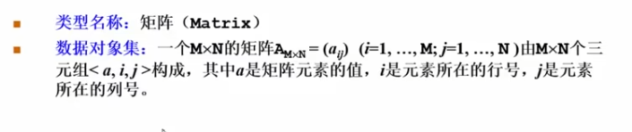
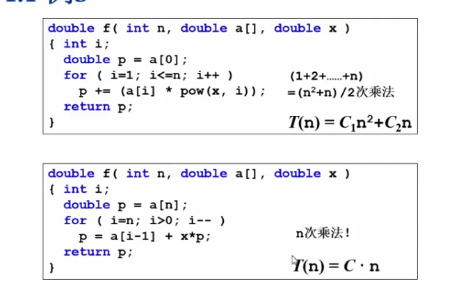
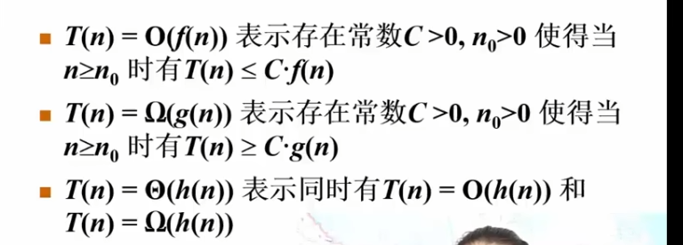
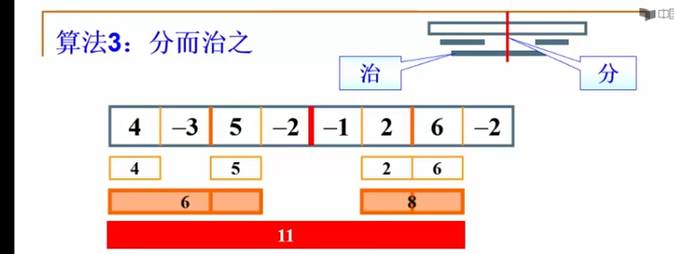
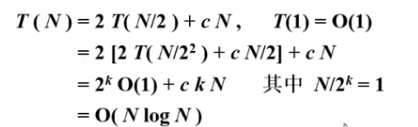
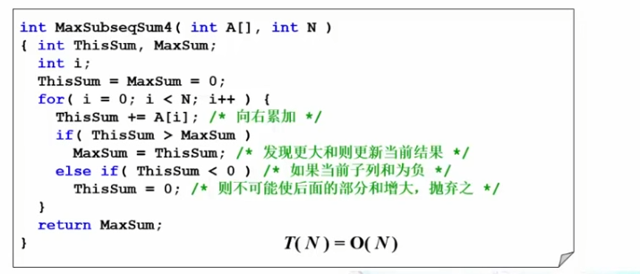

# 1.1 数据结构

## 算法的效率

- 空间利用率
- 时间利用率

## 例三：计算在特定定点 x 的多项式的值

### 第一种算法

```cpp
double f(int n, double a[], double x) {
    int i;
    double p = a[0];

    for (i = 1; i <= n; i++) {
        p += (a[i] * pow(x, i));
    }

    return p;
}
```

这是第一种算法。

### 第二种算法

```cpp
double f(int n, double a[], double x) {
    int i;
    double p = a[n];

    for (i = n; i > 0; i++) {
        p = a[i - 1] + x * p;
    }

    return p;
}
```

这是第二种算法。


第二种的速度更加快。

## 什么是数据结构

数据结构是数据对象在计算机中的组织方法。

- 逻辑结构
- 物理存储结构

1. 线性结构
2. 树形结构

## 抽象数据类型

### 数据类型

- 数据对象集
- 数据集合相关联的操作集
 
### 抽象：描述数据类型的方法不依赖于具体实现

- 与存放数据的机器无关
- 与数据存储的物理结构无关
- 与实现操作的算法和变成语言均无关

## 例四：“矩阵”的抽象数据类型定义



# 1.2 算法

- 一个有限指令集
- 接受一些输出
- 产生输出
- 一定在有限步骤之后终止
- 每一条指令必须
  - 有充分明确的目标，不可以有歧义
  - 计算机能处理的范围之内
  - 描述应该不依赖一任何一种计算机语言以及具体的实现手段

## 例一


其实就是将每一次的最小值和第一个调换达到排序的目的。

## 什么是好的算法

- 空间复杂度 S(n)
- 时间复杂度 T(n)

### 时间复杂度
常规来说乘法的时间远大于加减，所以我们计算乘除法次数来比较时间复杂度
见1.1例三    

第一个算法中次方算作n次乘法

在评价一个算法的时候，我们一般会考虑平均复杂度和最坏复杂度
## 复杂度的渐进表示法


## for and if-else
for用循环乘以循环内
if-else取三者最大的复杂度

# 1.3 应用实例：最大子列和问题 

## 算法一
```cpp
int MaxSubseqSum1(int A[], int N)
{
    int ThisSum, MaxSum = 0;
    int i, j, k;

    for (i = 0; i < N; i++) {          /* i 是子列左端位置,第一次嵌套 */
        for (j = i; j < N; j++) {      /* j 是子列右端位置，第二次嵌套 */
            ThisSum = 0;               /* ThisSum 是从 A[i] 到 A[j] 的子列和 */

            for (k = i; k <= j; k++)
                ThisSum += A[k];//这是第三次

            if (ThisSum > MaxSum)      /* 如果刚得到的这个子列和更大 */
                MaxSum = ThisSum;      /* 则更新结果 */
        }                              /* j 循环结束 */
    }                                  /* i 循环结束 */

    return MaxSum;
}
```
复杂度是O（N3）

## 算法二
```cpp
int MaxSubseqSum2(int A[], int N)
{
    int ThisSum, MaxSum = 0;
    int i, j;

    for (i = 0; i < N; i++) {          /* i 是子列左端位置 */
        ThisSum = 0;                   /* 从新的左端点重新开始计算 */

        for (j = i; j < N; j++) {      /* j 是子列右端位置 */
            ThisSum += A[j];           /* 得到 A[i] 到 A[j] 的子列和 */

            if (ThisSum > MaxSum)      /* 如果当前子列和更大 */
                MaxSum = ThisSum;      /* 更新最大子列和 */
        }
    }

    return MaxSum;
}
```

## 算法三

一个连续子列相对于这条分界线，只可能属于下面三种情况：
1. 完全在左边    
2. 完全在右边    
3. 从左边跨到右边    

不存在第四种情况，所以整个数组的最大子列和一定是：
max(左边最大子列和,右边最大子列和,跨越中线的最大子列和)

### 第一步
其实是这样的，我们先寻找跨越中线的最大子列和：
我们先从-2往左边延伸，找到最大的
然后从-1往右边延伸，找到包含-1的最大的
然后加起来就可以的

### 第二步：左边
然后左边的四个数我们同样一分为 2：

$$
[4,-3]\mid[5,-2]
$$

先找到左边两个数 `[4,-3]` 的最大子列和：

- 只取 `4`，和为 4
- 只取 `-3`，和为 -3
- 跨越中线取 `[4,-3]`，和为 $4-3=1$

所以 `[4,-3]` 的最大子列和是：

$$
4
$$

再找到右边两个数 `[5,-2]` 的最大子列和：

- 只取 `5`，和为 5
- 只取 `-2`，和为 -2
- 跨越中线取 `[5,-2]`，和为 $5-2=3$

所以 `[5,-2]` 的最大子列和是：

$$
5
$$

然后计算跨越中线的最大子列和。

左边必须包含靠近中线的 `-3`：

- 只取 `-3`，和为 -3
- 取 `[4,-3]`，和为 $4-3=1$

所以左边的最大后缀和为：

$$
1
$$

右边必须包含靠近中线的 `5`：

- 只取 `5`，和为 5
- 取 `[5,-2]`，和为 $5-2=3$

所以右边的最大前缀和为：

$$
5
$$

跨越中线的最大子列和为：

$$
1+5=6
$$

最后比较：

$$
\max(4,5,6)=6
$$

所以左边四个数 `[4,-3,5,-2]` 的最大子列和为 6。

### 第三步：右边
右边和左边同理得到8

### 第四步：比较三个
6，8，11最大值是11

### 时间复杂度


### 时间复杂度



我们将处理长度为 $N$ 的数组所需要的时间记为：

$$
T(N)
$$

每次都将数组平均分成左右两个部分。

计算左边最大子列和需要：

$$
T\left(\frac{N}{2}\right)
$$

计算右边最大子列和也需要：

$$
T\left(\frac{N}{2}\right)
$$

而计算跨越中线的最大子列和时，需要从中线分别向左、向右遍历，因此这一部分需要的时间为：

$$
O(N)
$$

所以可以得到递推关系：

$$
T(N)=2T\left(\frac{N}{2}\right)+O(N)
$$

接下来按照递归过程不断向下切分：

* 第一层处理 $N$ 个元素，总工作量为 $N$
* 第二层有两个长度为 $\frac{N}{2}$ 的数组，总工作量仍然为

$$
2\times\frac{N}{2}=N
$$

* 第三层有四个长度为 $\frac{N}{4}$ 的数组，总工作量仍然为

$$
4\times\frac{N}{4}=N
$$

所以，递归树中每一层的总工作量都是 $O(N)$。

数组每次都会被分成原来的一半，因此一共需要切分：

$$
\log_2 N
$$

层。

所以总时间复杂度为：

$$
T(N)=O(N + N\log N)
$$

因此，算法三的时间复杂度是：

$$
O(N\log N)
$$


## 算法四：在线处理



这个算法仔细想一下就会发现是正确的。

我们可以这样理解：

首先，先假设我们已经找到了最终正确的最大子列。

对于这个最大子列来说，如果我们在它的左边再增加一段和小于 0 的子列，那么这一段不仅没有正面作用，反而会让整个子列的和变小。

例如，假设真正的最大子列和是：

$$
10
$$

如果在它前面再加上一段和为：

$$
-3
$$

的子列，那么新的子列和就会变成：

$$
-3+10=7
$$

显然比原来的 10 更小。

所以，在寻找最大子列的过程中，如果前面已经累加出来的这一部分之和小于 0，那么这一部分一定不会包含在我们最终想要的最大子列中。

因此，当：

```cpp
ThisSum < 0
```

时，就可以直接把前面这一部分舍弃，并令：

```cpp
ThisSum = 0;
```

然后从下一个元素重新开始计算。

至于当前的子列和需不需要更新为最大值，就要判断当前的 `ThisSum` 是否大于之前记录的 `MaxSum`：

```cpp
if (ThisSum > MaxSum)
    MaxSum = ThisSum;
```

但是这里还有一种可能：

有人可能会问，我们现在舍弃的这一段中，会不会包含真正最大子列的开头？

其实也是不可能的。

假设数组中第 1 个元素到第 10 个元素的和小于 0，而真正的最大子列从第 5 个元素开始。

如果算法在遍历到第 10 个元素时，发现第 1 个元素到第 10 个元素的和小于 0，于是将这一整段舍弃，那么有人可能会担心，第 5 个元素之后的部分也被一起舍弃了。

但是，如果真正的最大子列是从第 5 个元素开始的，那么我们再看第 1 个元素到第 5 个元素这一部分。

如果第 1 个元素到第 5 个元素的和已经小于 0，那么算法在更早的时候就已经会把前面这一部分舍弃，并从第 6 个元素附近重新开始计算，而不会一直保留到第 10 个元素。

换句话说，只要前面的某一部分之和小于 0，它就不可能对后面的最大子列产生帮助。

假设某个最大子列前面包含了一段和小于 0 的部分，那么把这段负数部分删除以后，剩下子列的和一定会更大，这就说明原来的子列并不是最大子列。

所以，算法在发现：

```cpp
ThisSum < 0
```

时将其清零，不会错过真正的最大子列。

因此，这个算法是正确的。

### 时间复杂度

算法只需要从左到右遍历数组一次，每个元素只会被处理一次。

因此时间复杂度为：

$$
O(N)
$$

这也是四种算法中时间复杂度最低的一种算法。
