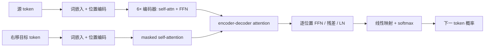

# Attention Is All You Need

> [论文](https://arxiv.org/abs/1706.03762) · [HTML](https://arxiv.org/html/1706.03762) · [论文所用 Tensor2Tensor](https://github.com/tensorflow/tensor2tensor)

## 证据标签

- **论文原文结论**：作者在正文、公式或表格中明确提出的结论。
- **客观事实**：可由论文设置、公开代码或数学推导直接核对。
- **我们的解释**：为了建立课程联系而做的教学性解释。
- **尚未验证的猜测**：合理但本页没有实验支持的推测，不作为结论。

## 论文地图

| 要素 | 内容 |
|---|---|
| 主张 | 仅由注意力与逐位置前馈层组成的序列到序列模型，可以摆脱循环和卷积并在机器翻译上达到更好质量/训练效率 |
| 关键机制 | 缩放点积注意力、多头注意力、位置编码、编码器—解码器堆叠 |
| 主要证据 | WMT 2014 英德/英法翻译结果、训练成本比较、结构消融与句法分析任务 |
| 适用边界 | 论文主要验证机器翻译；序列长度增加时全注意力时间/显存为二次增长 |
| 复现难点 | 旧数据处理与 Tensor2Tensor 版本、BLEU tokenization、训练预算和 beam-search 设置 |

证据链为：并行化与长程依赖问题 → 以注意力替代 recurrent transition → 在相近/更低训练成本下比较翻译质量 → 通过头数、维度、位置编码等消融检查设计 → 得出 Transformer 在这些设置下有效。注意最后一步不等于“循环网络在所有时序任务上都无用”。

## 论文试图解决的具体问题

2017 年主流神经机器翻译多用 RNN/LSTM/GRU 编码器—解码器，通常叠加 attention。循环结构必须按 token 顺序推进：第 $t$ 个隐藏状态依赖 $t-1$，因此单个样本内难以充分并行；任意两个位置的信息路径长度随距离增长。卷积可并行，但远距离交互要跨多层，路径长度随距离线性或对数增长。

**论文原文结论**：Transformer 用 attention 连接任意位置，把最长依赖路径降到常数层级，并允许整段 token 并行计算。**我们的解释**：真正的改动不是首次发明 attention，而是把 attention 从 RNN 上的辅助读写机制提升为主要序列混合算子，再用位置编码补回顺序信息。

## 前序方法及其真正限制

RNN 的限制首先是计算依赖，而非“完全记不住”。LSTM/GRU 的门控缓解梯度与记忆问题，但仍有串行递推。卷积模型能并行，局部卷积还具有平移归纳偏置；它的限制是远距离 token 需要多层传播。纯 attention 让一个位置单层访问所有位置，但付出 $O(L^2)$ 注意力矩阵成本，也弱化局部先验。

论文还提到此前已有仅用 attention 的模型，但往往只在输入或输出局部使用；本文把 encoder 与 decoder 的序列交互都系统替换。**客观事实**：论文的创新是架构组合、缩放、多头和工程训练配方共同形成的系统，而不是单一公式孤立出现。

## 核心假设与方法概览

核心假设有三条：

1. token 间内容相关性可以由 query–key 相似度动态计算；
2. 多个子空间并行注意可以表达不同关系；
3. 顺序无需由递推隐状态承载，可以显式加入位置表示。

编码器有 6 层，每层包含多头自注意力与逐位置前馈网络；解码器有 6 层，额外加入对编码器输出的 cross-attention，并用 causal mask 防止看到未来目标 token。论文原始结构是 sublayer 后残差再 LayerNorm，即常称 Post-LN；很多后续大模型改用 Pre-LN，不能把后来的训练经验倒写成原论文结构。

## 模型输入、输出与完整数据流

源 token 与已右移的目标 token 分别查 embedding 并加位置编码。训练时 decoder 一次接收整个目标前缀矩阵，通过上三角因果掩码阻止第 $t$ 个位置读取 $t+1$ 以后真值；输出线性层与 softmax 给出下一 token 分布。

若 batch 为 $B$，源长度 $S$，目标长度 $T$，base 模型 $d_{model}=512$，则 encoder 表示为 `[B,S,512]`；decoder self-attention 分数为 `[B,8,T,T]`；cross-attention 分数为 `[B,8,T,S]`。逐位置 FFN 对每个 token 独立应用同一两层 MLP：

$$
\operatorname{FFN}(x)=\max(0,xW_1+b_1)W_2+b_2,
$$

base 模型中隐藏维从 512 扩到 $d_{ff}=2048$ 再投回 512。

## 关键符号与核心公式推导

### 缩放点积注意力

给定 $Q\in\mathbb R^{L_q\times d_k}$、$K\in\mathbb R^{L_k\times d_k}$、$V\in\mathbb R^{L_k\times d_v}$：

$$
\operatorname{Attention}(Q,K,V)
=\operatorname{softmax}\left(\frac{QK^\top}{\sqrt{d_k}}\right)V.
$$

假设 $q_i,k_i$ 各坐标独立、均值 0、方差 1，则点积 $q^\top k=\sum_{i=1}^{d_k}q_ik_i$ 的方差约为 $d_k$，标准差约为 $\sqrt{d_k}$。不缩放时，维度大使 logit 绝对值变大，softmax 接近 one-hot，非最大项梯度很小。除以 $\sqrt{d_k}$ 把初始化时尺度拉回常数量级。这个推导解释的是统计尺度，不表示训练后每个坐标仍独立标准化。

### 多头注意力

$$
head_i=\operatorname{Attention}(QW_i^Q,KW_i^K,VW_i^V),
$$

$$
\operatorname{MultiHead}(Q,K,V)=
\operatorname{Concat}(head_1,\ldots,head_h)W^O.
$$

base 模型 $h=8$，每头 $d_k=d_v=64$，拼接后仍为 512。固定总维度时，多头不是简单把计算量乘 8；每头维度相应缩小。它增加投影参数与表达分解，使不同 query 可以在不同子空间形成不同分布。

### 正弦位置编码

$$
PE_{(pos,2i)}=\sin\left(pos/10000^{2i/d_{model}}\right),
$$

$$
PE_{(pos,2i+1)}=\cos\left(pos/10000^{2i/d_{model}}\right).
$$

不同维度对应不同频率。利用三角恒等式，$PE(pos+k)$ 可由 $PE(pos)$ 的每对正余弦经一个依赖 $k$ 的线性旋转得到，因此相对偏移具有可表达结构。**论文原文结论**：学习位置 embedding 与正弦版本结果接近，作者选择正弦编码并提出可能外推更长序列。**尚未验证的猜测**：仅凭这个结构就能可靠外推任意长度；原论文并未充分验证这种强结论。

## 网络结构、训练目标与损失函数

base 配置为 6 层 encoder/decoder、$d_{model}=512$、$d_{ff}=2048$、8 头、dropout 0.1。每个 sublayer 使用 residual connection 与 LayerNorm。词嵌入与 pre-softmax 线性变换共享权重，并乘 $\sqrt{d_{model}}$ 调整 embedding 尺度。

训练最小化 teacher-forced token 交叉熵，并使用 label smoothing $\epsilon_{ls}=0.1$。label smoothing 会让困惑度的解释发生变化，却可能提高准确率与 BLEU。优化器为 Adam，论文给出 $\beta_1=0.9,\beta_2=0.98,\epsilon=10^{-9}$；学习率调度为

$$
\eta= d_{model}^{-1/2}
\min(step^{-1/2},step\cdot warmup^{-3/2}),
$$

warmup 为 4000 步。前期线性升温，之后按逆平方根衰减。

## 训练流程与推理流程的区别

训练时目标序列全部已知，可并行计算所有位置，但 causal mask 保证每个位置只用前缀；这叫 teacher forcing。推理时未来 token 不存在，decoder 自回归地产生一个 token，再把它加入前缀。即使每一步内部并行，token 生成过程仍串行。

论文机器翻译使用 beam search 与长度惩罚。BLEU 不只由模型权重决定，还受分词、beam size、长度惩罚、checkpoint averaging 与 detokenization 影响。复现若只对齐训练损失而不对齐解码协议，不能期待相同 BLEU。

## 数据集、评测协议、基线与指标

论文使用 WMT 2014 English–German 与 English–French。主要指标为 tokenized BLEU，并比较既有 recurrent、convolutional 与 ensemble 系统，同时列出训练 FLOPs 的估计。base 模型在 8 张 NVIDIA P100 上约训练 12 小时，big 模型约 3.5 天；这些是论文时代硬件与实现的数据，不能直接换算成今天硬件的成本。

**客观事实**：big Transformer 在英德任务报告 28.4 BLEU，在英法任务报告 41.8 BLEU。**论文原文结论**：在当时比较中取得新的最好结果且训练成本较低。这里的“最好”受论文选取的公开基线、数据处理和 2017 年时间点限制，不应写成永恒排名。

## 主实验、消融实验与关键图表解读

主表同时列质量与训练成本，支持“并行架构具有更好质量—成本权衡”的主张。英法 41.8 使用 big 模型；英德 28.4 也来自 big 配置。不能把 base 训练 12 小时与 big 的最高 BLEU拼成同一个设置。

消融表改变注意力头数、key/value 维度、模型维度、FFN 维度、dropout 与位置编码。单头比多头差，但头数继续增加也非单调提升；减小 key 维度会伤害质量；更大模型通常更好而 dropout 对防过拟合重要。**我们的解释**：证据支持“多个头与足够表示容量有用”，不支持“头越多越好”或每个头都学到可解释的语言关系。

论文还在 English constituency parsing 上评估，表明架构并非只能做翻译。但任务数量仍有限，不能由此推出对所有模态、所有长度和低数据任务普遍占优。

## 主要结论的证据充分性

| 结论 | 证据 | 审读判断 |
|---|---|---|
| 无循环/卷积也能做高质量翻译 | 两个 WMT 主任务 | 在论文设置内充分 |
| 训练更可并行、成本更低 | 训练时间/FLOPs 与结构分析 | 方向有力，但跨实现硬件比较有限 |
| 多头优于单头 | 受控消融 | 有支持，但最优头数非普遍常数 |
| 能学习长程依赖 | 常数路径长度与翻译结果 | 间接支持；缺少专门长上下文压力测试 |
| 注意力权重提供解释 | 论文展示若干头模式 | 只能作为可视化线索，不能证明因果解释 |

## 论文局限、失败条件与混淆因素

1. 全注意力对长度的时间和内存为 $O(L^2)$，长文档、高分辨率视觉会迅速昂贵。
2. 主要实验是高资源翻译；低资源、在线流式、超长序列和强局部先验任务证据不足。
3. 训练成本表来自不同论文与实现，FLOPs 估计不能完全消除工程差异。
4. BLEU 对分词和解码敏感，且不等价于语义正确性或人类偏好。
5. Post-LN 深层扩展的稳定性后来成为问题，原论文规模较浅。
6. 正弦位置编码外推只是动机之一，原实验没有系统验证极长外推。

## 官方代码结构、运行环境与复现成本

论文代码落在 Tensor2Tensor 框架中，今天直接重建旧依赖的成本可能高于重写一个最小模型。完整 WMT big 复现需要数据清洗、子词模型、多 GPU 训练、checkpoint averaging 与一致 BLEU 脚本。官方仓库已是历史项目，环境应容器化固定，不建议把现代库的默认行为当作原实现。

**客观事实**：论文公开了足以重建模型的主要超参数。**我们的解释**：精确 BLEU 复现的最大风险不在注意力公式，而在数据与评测流水线。

## 可执行的最小复现方案

在现有普通算力下，首个目标不应是复刻 28.4 BLEU，而是验证机制：

1. 选 Multi30k 或小规模合成 copy/reverse 任务，固定 tokenizer 与数据划分。
2. 实现 2 层 encoder/decoder，$d_{model}=128$、4 头、$d_{ff}=512$。
3. 对照 Transformer、单头版本和去位置编码版本；参数量尽量匹配。
4. 固定 3 个随机种子，报告验证交叉熵、序列准确率、训练 token/s 与峰值显存。
5. 用超出训练长度的序列测试位置外推，但明确这是额外实验，不是原论文复现。
6. 保存配置、提交 SHA、tokenizer 与解码参数；不发布任何私有数据。

停止条件：三种设置训练曲线正常，Transformer 能解决任务，消融方向稳定；若要声称接近原论文 BLEU，必须升级到相同 WMT 版本和评测协议。

## 与其他论文、课程知识和 VLA 主线的关系

本论文连接线性代数中的矩阵乘法、概率中的 softmax 分布、深度学习中的残差/归一化，以及 VLA 中多模态 token 交互。OpenVLA 将视觉编码器输出接入 Llama 系列语言模型并把动作离散成 token；π0 使用 VLM 骨干和动作专家，仍依赖 Transformer 处理视觉、语言与动作条件。二者的动作输出不同，但共享注意力的条件信息路由。

## 阅读后仍未解决的问题

1. 多头究竟通过表达多样性、优化条件还是冗余带来收益？
2. 注意力的二次复杂度在何种长度上真正成为瓶颈，取决于硬件和 kernel 的哪部分？
3. 位置编码应如何同时支持局部精度、长度外推与多模态空间坐标？
4. 注意力权重与因果贡献之间能建立怎样可验证的联系？

## 审读结论

论文的核心主张在 2017 年机器翻译设置内得到强证据：纯 attention 架构既可训练又有优异质量，且并行优势清晰。其最持久贡献是一个可扩展的序列计算接口，而不是“attention 在所有场景都足够”。复现应优先对齐数据与解码协议；教学应明确原始 Post-LN 架构与后续变体的区别。

**尚未验证的猜测**：如果只保留注意力公式而去掉论文中的残差、归一化、学习率调度和数据工程，仍能获得同样优势。本页不接受这一猜测，系统配方本身就是论文成功的一部分。

