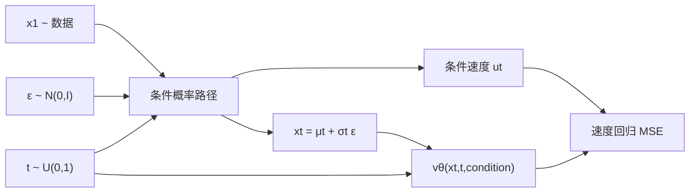

# Flow Matching for Generative Modeling

> [论文](https://arxiv.org/abs/2210.02747) · [可读 HTML](https://ar5iv.labs.arxiv.org/html/2210.02747) · [官方 Flow Matching 库](https://github.com/facebookresearch/flow_matching)

## 证据标签

- **论文原文结论**：论文明确陈述并以理论或实验支持。
- **客观事实**：由定义、公式、实验设置或官方代码可核验。
- **我们的解释**：本站为连接概率、ODE 与生成模型所作的解释。
- **尚未验证的猜测**：没有在本文设置中完成验证的延伸判断。

## 论文地图

| 要素 | 内容 |
|---|---|
| 目标 | 不模拟扩散 SDE 轨迹，直接训练连续归一化流的时间依赖向量场 |
| 关键桥梁 | 用条件概率路径定义 Conditional Flow Matching；其梯度与不可直接计算的边际 FM 目标一致 |
| 路径选择 | 兼容扩散路径，也允许更直接的 Optimal Transport 条件路径 |
| 训练 | 随机采样数据、时间、噪声，做向量场回归；无需训练时数值积分 |
| 推理 | 从简单基分布采样，使用 ODE 求解器积分学习到的向量场 |
| 主要证据 | 理论等价关系、ImageNet 生成质量与采样效率、路径/求解器分析 |

本论文最容易被误读成“又一种 loss”。更准确的结构是：先选一族连接噪声与数据的概率路径，再找产生这条路径的速度场，最后用条件化把不可积的边际速度监督变成可采样的回归目标。路径、目标和 ODE 求解器是三个不同层次。

## 论文试图解决的具体问题

Continuous Normalizing Flow（CNF）通过 ODE 把简单分布连续变为数据分布，具有精确变化变量结构，但传统训练常需在每一步数值积分 ODE、计算散度或最大似然，成本高且优化困难。扩散模型的 score matching 提供稳定训练，但其通常从特定噪声过程和随机微分方程出发。

论文的问题是：能否直接监督 CNF 的向量场，并允许任意可控的概率路径，而不在训练时求解 ODE？**论文原文结论**：Flow Matching 可以回归目标概率路径的速度场；Conditional Flow Matching 产生同样的优化梯度且可采样。**我们的解释**：它把“生成分布”转成“学习一张随时间变化的交通速度地图”。

## 前序方法及其真正限制

最大似然 CNF 要通过瞬时变量替换公式累积对数密度，其中含 $\nabla\cdot v_t$；反向还要穿过 ODE 求解。扩散/score 方法训练时可用噪声条件分数回归，但路径通常由扩散过程指定，采样轨迹可能弯曲，需要较多函数评估。

本文不是否定扩散：它证明扩散路径也可写进 FM 框架，并把 score 参数化与 vector-field 参数化联系起来。真正扩展是允许非扩散路径，尤其是条件 OT 路径。**客观事实**：所谓“OT”首先描述每个噪声—数据条件对的高斯路径；它不自动等于整个数据分布与基分布之间的全局最优传输映射。

## 核心假设与方法概览

设基分布为 $p_0$（常用标准高斯），目标数据分布为 $q=p_1$。希望时间依赖向量场 $v_t(x)$ 的流映射 $\phi_t$ 满足

$$
\frac{d}{dt}\phi_t(x)=v_t(\phi_t(x)),\qquad \phi_0(x)=x,
$$

并使 $p_t=(\phi_t)_\#p_0$，最终 $p_1\approx q$。这里 pushforward 表示把 $p_0$ 的样本经映射推到新分布。

方法分四步：选择条件路径 $p_t(x\mid x_1)$；得到其条件速度 $u_t(x\mid x_1)$；随机采样 $x_1,t,x$ 回归速度；推理时积分学习到的边际场 $v_\theta$。

## 连续性方程与核心公式

### 概率守恒

密度随速度场移动必须满足连续性方程

$$
\partial_t p_t(x)+\nabla\cdot[p_t(x)u_t(x)]=0.
$$

第一项是某点密度随时间变化，第二项是概率通量的散度。它与流体质量守恒同形。若 $u_t$ 产生 $p_t$，从 $p_0$ 按 ODE 推进样本就会在时刻 $t$ 服从 $p_t$。

### 理想 Flow Matching 目标

若边际路径 $p_t$ 与其目标速度 $u_t$ 可得，定义

$$
\mathcal L_{FM}(\theta)=
\mathbb E_{t\sim U[0,1],x\sim p_t}
\lVert v_\theta(x,t)-u_t(x)\rVert_2^2.
$$

困难在于数据分布是经验样本混合，边际 $u_t(x)$ 通常要对所有条件数据积分，无法直接计算。

### Conditional Flow Matching

对数据点 $x_1\sim q$ 定义可处理的条件路径 $p_t(x\mid x_1)$ 和条件速度 $u_t(x\mid x_1)$，使

$$
p_t(x)=\int p_t(x\mid x_1)q(x_1)dx_1.
$$

边际速度是条件速度的后验加权平均：

$$
u_t(x)=\int u_t(x\mid x_1)
\frac{p_t(x\mid x_1)q(x_1)}{p_t(x)}dx_1.
$$

可训练目标为

$$
\mathcal L_{CFM}(\theta)=
\mathbb E_{t,x_1,x\sim p_t(\cdot\mid x_1)}
\lVert v_\theta(x,t)-u_t(x\mid x_1)\rVert_2^2.
$$

对平方损失求梯度，所有只依赖目标的二次项消失；交叉项对 $x_1$ 条件期望后正好得到边际 $u_t(x)$。因此在适当正则条件下，CFM 与 FM 对 $\theta$ 的梯度相同。注意是梯度等价，不是两个损失数值必然完全相同；它们可以相差与 $\theta$ 无关的常数。

## 高斯条件路径与 OT 路径推导

设

$$
p_t(x\mid x_1)=\mathcal N(x\mid\mu_t(x_1),\sigma_t(x_1)^2I).
$$

用重参数化 $x=\mu_t+\sigma_t\epsilon$，固定 $\epsilon\sim\mathcal N(0,I)$ 对时间求导：

$$
\frac{dx}{dt}=\dot\mu_t+\dot\sigma_t\epsilon
=\dot\mu_t+\frac{\dot\sigma_t}{\sigma_t}(x-\mu_t).
$$

所以条件速度可取

$$
u_t(x\mid x_1)=
\frac{\dot\sigma_t}{\sigma_t}(x-\mu_t)+\dot\mu_t.
$$

条件 OT 路径选

$$
\mu_t=tx_1,\qquad
\sigma_t=1-(1-\sigma_{min})t.
$$

于是 $t=0$ 接近标准高斯，$t=1$ 接近以 $x_1$ 为中心、方差 $\sigma_{min}^2I$ 的窄高斯。代入得

$$
u_t(x\mid x_1)=
\frac{x_1-(1-\sigma_{min})x}
{1-(1-\sigma_{min})t}.
$$

从具体噪声样本 $x_0$ 看，路径近似线性插值 $x_t=[1-(1-\sigma_{min})t]x_0+tx_1$，条件轨迹方向恒定，因此比某些扩散路径更直。可是训练得到的是对许多条件速度求后验平均的边际场；不同配对交叉后，边际轨迹仍可能弯曲。

## 模型输入、输出与完整数据流

模型输入是带噪中间样本 $x_t$、连续时间 $t$，在 class-conditional 生成中还包括类别 $y$。输出与 $x_t$ 同形状的速度向量。图像 `[B,C,H,W]` 输入对应同形输出；时间通过 embedding 注入网络。

训练每个 batch 只需一次网络前向/反向，不必从 0 积分到 $t$。推理则相反：从 $x_0\sim p_0$ 出发，多次调用网络，按 Euler、Heun 或自适应 ODE solver 更新到 $t=1$。

## 训练流程与推理流程的区别

训练：采数据 $x_1$、时间 $t$、噪声 $\epsilon$；解析构造 $x_t$ 与目标速度；最小化 MSE。它是 simulation-free training，意思是不用数值模拟整条生成轨迹，不是“无需采样”或“推理一步完成”。

推理：解

$$
x_{k+1}=x_k+\Delta t\,v_\theta(x_k,t_k)
$$

或更高阶更新。函数评估次数 NFE 决定大部分延迟。较直的场可能允许大步长，但实际误差还取决于网络逼近、求解器阶数、误差容限、guidance 和数据维度。

## 数据集、评测协议、基线与指标

论文在 ImageNet 多个分辨率上评估，使用与扩散模型相近的网络骨干与训练设置比较路径。指标包括 FID、Inception Score、likelihood/相关生成质量指标以及 ODE 采样的 NFE。基线包含 diffusion probability-flow/score 路线和既有生成模型结果。

比较最重要的控制变量是网络、训练步数、增强与求解器。若 OT 路径使用不同 solver 或容差，NFE 改善可能来自求解器而非路径。论文专门分析 solver error 与 NFE，说明作者意识到这一混淆因素。

## 主实验、消融与关键图表解读

**论文原文结论**：使用 OT 条件路径的 Flow Matching 在 ImageNet 上取得有竞争力乃至更好的生成质量与似然，并提高采样效率。实验显示 OT 路径的轨迹通常更简单；在一个误差—NFE 对比中，达到相同误差阈值约需要基线 60% 左右的函数评估。这个比例来自特定网络、求解器与阈值，不能写成所有 FM 都“固定快 40%”。

路径消融比较 diffusion 风格与 OT 风格条件路径。OT 版本的训练目标更像从噪声到数据的直线运输；效果支持“路径设计会显著影响可学性和采样”。同时，论文展示 FM 可以直接覆盖 diffusion paths，说明收益不是仅来自换一个损失名字。

## 主要结论的证据充分性

| 结论 | 证据 | 审读判断 |
|---|---|---|
| CFM 可替代不可计算的 FM 监督 | 梯度等价定理 | 理论充分，依赖正则与采样条件 |
| 训练无需 ODE 模拟 | 构造与算法 | 充分；推理仍需积分 |
| OT 条件路径更易采样 | ImageNet NFE/误差分析 | 在论文设置内支持，不是普遍定理 |
| FM 严格优于所有扩散模型 | 没有覆盖所有架构/配方 | 不支持这种强表述 |
| 条件 OT 等于全局 OT | 条件路径定义 | 不成立；需区分条件与边际 |

## 论文局限、失败条件与混淆因素

1. 推理仍要多次网络评估；simulation-free 只描述训练。
2. 条件目标方差可能很大：同一 $x_t$ 对应多个 $x_1$ 与条件速度，网络学习其条件平均。
3. OT 条件路径的线性配对不等于全局数据—噪声最优配对，边际场仍可弯曲。
4. 论文主要是图像生成，大规模语言、音频和机器人动作的约束不同。
5. FID 有估计噪声并依赖特征网络，不覆盖所有视觉质量与多样性。
6. NFE 不等于 wall-clock；solver 控制流、batch、缓存、精度和硬件都会改变真实速度。
7. $t\to1$ 且 $\sigma_{min}$ 很小时，公式分母与局部场可能数值敏感。

## 官方代码结构、运行环境与复现成本

官方 `flow_matching` 仓库提供路径、solver 与训练组件，但当前库版本不等同于 2022 年论文实现。精确论文复现要固定论文代码提交、ImageNet 预处理、网络、训练预算、EMA、采样器与 FID 统计。完整 ImageNet 训练成本高，数据也受许可约束。

建议代码审计从四个接口开始：probability path 如何采样 $x_t$；target vector field 是否与路径导数一致；时间方向是 0→1 还是 1→0；solver 的时间网格与输出解码如何定义。很多“公式正确但样本坏”的 bug 来自方向符号或归一化。

## 可在现有算力执行的最小复现方案

1. 用二维 eight-Gaussians 或 moons 数据，基分布为二维标准高斯。
2. 小 MLP 输入 $(x_t,t)$ 输出二维速度，分别训练 OT path 与 diffusion-like path。
3. 固定相同网络、batch、训练步数和种子；每个设置至少 3 个种子。
4. 训练时画条件样本、目标向量与 learned field；推理用 Euler、Heun 分别测试 5/10/20/50 NFE。
5. 用 sliced Wasserstein、MMD 与可视化比较生成分布；报告 NFE—误差曲线和 wall-clock。
6. 做数值一致性检查：对解析条件轨迹有限差分，验证 $dx_t/dt$ 与 target velocity。

进一步的小图像复现可用 MNIST/CIFAR-10，但先证明二维路径与方向正确。最小复现的目标是验证 CFM 梯度可学、OT 路径采样趋势与 solver 误差，不是声称复刻 ImageNet SOTA。

## 与其他论文、课程知识和 VLA 主线的关系

本论文连接概率密度、条件期望、ODE、连续性方程与深度网络回归。π0 把 flow matching 用于连续机器人动作块：条件从类别标签变为图像、语言和本体状态，输出从图像速度场变为动作空间速度场。共同点是噪声—数据路径与向量场回归；差异是动作必须满足实时闭环、坐标和安全约束。

与 diffusion 的关系不是二选一：diffusion probability path 可落入 FM 统一框架；不同参数化可在噪声预测、score、velocity 之间转换。实现时必须根据所选路径重新推导系数，不能复制另一套调度器公式。

## 阅读后仍未解决的问题

1. 如何设计降低条件速度方差的噪声—数据配对，而不付出全局 OT 高成本？
2. 更直路径带来的 NFE 优势在大规模 Transformer 和高维动作空间是否稳定？
3. 训练时间分布是否应均匀；怎样按局部难度重加权而不改变目标？
4. solver truncation error、模型误差与数据误差应如何分解？
5. 带物理约束或接触不连续的动作空间是否需要非欧氏路径？

## 审读结论

Flow Matching 的核心价值是把 CNF 训练改写成可采样的监督回归，并把概率路径选择变成显式设计变量。CFM 梯度等价是理论支点，OT 条件路径的 ImageNet 结果是经验支点。最重要的边界是：训练免模拟不等于推理免积分；条件 OT 不等于边际全局 OT；较低 NFE 是设置相关的实验结果。

**尚未验证的猜测**：任何数据上直线条件路径都最优。多模态分布、约束流形和高噪声配对可能让条件目标冲突，真正最易学习的路径需要结合模型、配对和求解器共同决定。

