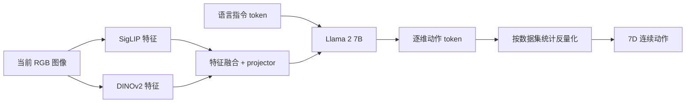

# OpenVLA

> [论文](https://arxiv.org/abs/2406.09246) · [项目页](https://openvla.github.io/) · [官方代码](https://github.com/openvla/openvla)

## 证据标签

- **论文原文结论**：作者在论文中明确提出的主张。
- **客观事实**：可由论文公式、表格、配置或官方仓库核验。
- **我们的解释**：对架构与机器人学习含义的教学转述。
- **尚未验证的猜测**：没有由本文实验充分验证的延伸判断。

## 论文地图

| 要素 | 内容 |
|---|---|
| 目标 | 建立可下载、可微调的通用 7B VLA，降低闭源大模型机器人策略的研究门槛 |
| 数据 | Open X-Embodiment 中约 970k 真实机器人示范，跨多种机器人与任务 |
| 骨干 | Prismatic-7B VLM：融合 SigLIP 与 DINOv2 视觉特征，接入 Llama 2 7B |
| 动作表示 | 每个动作维离散为 256 个 bin，映射到语言模型词表中的动作 token |
| 训练目标 | 给定图像和语言，自回归预测动作 token 的交叉熵 |
| 主要证据 | 跨 29 个任务与 RT-2-X 等比较，参数效率、视觉编码器消融、下游微调实验 |
| 核心边界 | 离散化与自回归延迟、异构数据动作定义、真实机器人 trial 数与开放数据覆盖 |

## 论文试图解决的具体问题

RT-2-X 等 VLA 表明，预训练视觉语言模型可以转化为跨任务机器人策略，但模型、数据或训练流程未必完整开放。研究者很难复查动作 token 化、数据混合与微调细节，也难在自己的机器人上进行受控实验。

OpenVLA 的问题不是“VLA 是否可能”，而是“能否用开放的 VLM、开放机器人数据和公开训练/微调代码，得到有竞争力的通用策略”。**论文原文结论**：7B OpenVLA 在作者的 29 项真实机器人评测中比 55B RT-2-X 平均成功率高 16.5 个百分点，同时参数量约少 7 倍。这个结论限定在论文任务集合、执行栈与 trial 设计内。

## 前序方法及其真正限制

RT-1 把动作离散化并用 Transformer 预测；RT-2 把机器人动作编码成语言 token，利用大规模 VLM 语义能力；Open X-Embodiment 汇总多机构、多机器人数据。前序路线的限制包含：权重/代码不开放、模型太大难微调、数据动作空间异构、不同实验室评测不统一。

**我们的解释**：OpenVLA 的主要贡献是开放系统集成与强基线，而不是提出全新序列建模原理。其方法把公开 VLM 能力、双视觉表征、动作 tokenizer 和 OXE 数据工程组合起来。系统贡献同样需要严格审查：数据过滤、动作归一化与评测接口会显著改变结果。

## 核心假设与方法概览

1. 互联网视觉—语言预训练提供语义、物体和场景表征，可迁移到机器人控制。
2. DINOv2 偏向空间/几何特征，SigLIP 偏向语义对齐，融合比单一路线更适合操作。
3. 连续动作可以量化为有限 token，从而用标准语言模型交叉熵训练。
4. 跨机器人数据的共同结构足以抵消动作空间差异，前提是为每个数据集正确归一化与解码。

OpenVLA 以 Prismatic VLM 为起点：视觉输入分别经过两个冻结/可训练视觉塔，特征融合后由 projector 映射到 LLM hidden space，与文本 token 一起送入 Llama 2 7B。机器人训练阶段输出动作 token；论文消融显示视觉编码器是否参与微调很重要。

## 模型输入、输出及完整数据流

单个训练样本至少包含当前 RGB 图像、自然语言指令和连续动作向量。不同数据集还可能有多视角、状态和不同长度；OpenVLA 的统一训练接口要选取/变换成共同格式。

论文常用动作是 7 维控制：6 维末端位姿增量加 1 维夹爪，但具体数据集含义和坐标系必须读配置，不能把“7D”当成跨机器人统一物理量。输出每个维度对应一个离散 token，自回归生成后再用该数据集的 bin 边界反量化。

## 关键符号与动作公式推导

设第 $j$ 个动作维训练数据分布的第 1 与第 99 百分位为 $q_{j,01},q_{j,99}$。论文把区间划分为 256 个 bin，超出范围的值裁剪。简化写法为

$$
z_j=\operatorname{clip}\left(
\left\lfloor 256\frac{a_j-q_{j,01}}
{q_{j,99}-q_{j,01}}\right\rfloor,0,255\right).
$$

每个 $z_j$ 映射到一个保留 token。OpenVLA 覆写 Llama tokenizer 中 256 个最少使用的 token，使语言模型输出层可直接产生动作类别。反量化可取 bin 中心：

$$
\hat a_j=q_{j,01}+\left(z_j+\tfrac12\right)
\frac{q_{j,99}-q_{j,01}}{256}.
$$

这带来半 bin 宽的典型量化误差；分位数外动作会饱和。分位数裁剪增强对极端离群值的鲁棒性，但若真实任务需要尾部快速动作，裁剪可能系统限制控制幅度。

给定上下文 $c=(image,instruction)$ 与动作 token 序列 $z_{1:D}$，训练损失为 teacher-forced 自回归交叉熵：

$$
\mathcal L=-\sum_{j=1}^{D}
\log p_\theta(z_j\mid c,z_{<j}).
$$

token accuracy 衡量离散 bin 是否完全命中，但相邻 bin 错误和相隔很远的错误都记为一次错，未反映连续控制距离。因此还应解码后报告 L1/L2，并最终做闭环 rollout。

## 网络结构与张量形状

精确视觉 token 数取决于 Prismatic 配置与图像处理。设两个视觉塔各输出 `[B,N,d_v]`，融合后经 projector 得 `[B,N,d_{llm}]`；文本为 `[B,L,d_{llm}]`，拼接/插入后总上下文长度约 $N+L$。LLM 最后产生词表 logits `[B,L_{out},|V|]`，动作位置只在 256 个动作 token 对应类别上学习有效区分。

融合两个视觉塔不等于简单“参数翻倍”：视觉特征对齐、token 数和投影方式决定实际显存。论文消融比较单视觉塔、融合塔以及冻结/微调策略，支持空间与语义特征互补。

## 训练流程与推理流程的区别

训练时，图像、语言和完整动作 token 都可用于 teacher forcing；一次前向计算所有动作位置的 loss。推理时，真实动作 token 不存在，模型逐个生成，已生成 token 会成为后续维度上下文。若第一个维度错误，可能影响后面维度。

推理还要加载对应数据集/机器人动作统计并反量化。使用错误的 normalization key 即使 token 看似合理，也会产生错误量纲或方向。真实部署还包含相机采集、模型延迟、低层控制器、安全限幅与重新观测；论文模型只覆盖其中的策略部分。

## 数据集、评测协议、基线与指标

预训练来自 Open X-Embodiment，约 970k 真实机器人示范，跨多种 embodiments、任务与实验室。异构性是优势也是混淆：相似自然语言可能对应不同坐标系、控制频率和夹爪编码。数据 mixture 与 normalization registry 是方法的一部分。

真实机器人评测覆盖 29 个任务并比较 RT-2-X 等基线。主要指标是 task success。下游适配还比较 full fine-tuning、LoRA 等方案，并在若干单/多任务设置与从头训练策略如 Diffusion Policy 对比。**论文原文结论**：OpenVLA 的微调在论文设置下以 20.4 个百分点优势超过 Diffusion Policy。不能把这个差值推广到任意数据量、任务或 Diffusion Policy 调参。

成功率是二项比例。每任务 trial 数若小，单次成功就会显著改变百分比；应同时给出任务级结果、trial 数与置信区间，而不是只看跨任务平均。

## 主实验、消融实验和关键图表解读

主实验支持三点：开放 7B 模型可以达到强通用控制结果；相对更大 RT-2-X 有参数效率；大规模跨机器人预训练能帮助下游微调。图表中的平均成功率掩盖任务差异，精读时应检查哪些任务改善、哪些退化，以及是否集中在视觉语义或空间精度需求。

视觉消融表明融合 DINOv2+SigLIP 且在机器人训练中微调视觉编码器表现更好。**我们的解释**：互联网特征并非天然适合接触几何，机器人动作损失需要调整视觉表征。该结果不意味着所有层都必须相同学习率全量训练；更细的层级冻结与学习率消融仍可研究。

微调实验说明预训练策略可适配新数据。LoRA 降低可训练参数和显存，但 full fine-tuning 可能提供更高上限。评估二者时应同时比较数据量、wall-clock、显存、checkpoint 大小与成功率。

## 每条主要结论是否被证据支持

| 结论 | 证据 | 审读判断 |
|---|---|---|
| 开放 7B VLA 可达到强真实机器人性能 | 29 任务对比 | 在论文平台内有力 |
| 比 RT-2-X 普遍更强 | 平均 +16.5 个百分点 | 只对论文任务集合成立 |
| 双视觉塔互补 | 架构消融 | 有支持，仍受训练预算影响 |
| 视觉编码器微调重要 | 冻结/微调消融 | 在该配方内充分 |
| 离散 token 是最佳动作表示 | 未与所有连续生成头全面对齐比较 | 不充分 |
| 跨机器人预训练必然正迁移 | 平均结果 | 可能有负迁移任务，需逐任务检查 |

## 论文局限、失败条件与混淆因素

1. 256-bin 动作离散化产生量化误差与边界饱和。
2. 自回归逐维动作增加延迟，动作维顺序还可能影响错误传播。
3. 不同数据集的动作语义、坐标系、频率和相机差异依赖大量手工 registry。
4. 真实机器人任务和 trial 数有限，平均成功率的不确定性不可忽略。
5. 与闭源/超大基线比较难完全对齐训练数据、模型可见信息与工程栈。
6. VLM 语义先验可能帮助物体识别，但精确接触与遮挡仍可能失败。
7. 7B 模型仍有显存与延迟门槛；“更小”是相对 55B，不等于边缘设备轻量。
8. 开放权重不等于所有预训练数据可任意再分发；使用者仍需检查许可证。

## 官方代码结构、运行环境与复现成本

官方仓库提供模型加载、动作解码、数据集转换、LoRA/full fine-tuning 和机器人部署示例。复现首先要锁定 commit 与 checkpoint 版本；其次核对 `dataset_statistics.json`/normalization key；再次确认图像预处理、prompt 模板和动作维顺序。

推理 7B 模型通常需要具备足够显存的 GPU；训练全参数版本成本高，LoRA 更适合单机验证。完整 OXE 预训练需要大规模数据存储、转换和多 GPU，不属于首个复现目标。真实机器人复现还需要硬件、相机标定和安全控制，成本远高于离线 action prediction。

## 可在现有算力执行的最小复现方案

分三层逐步验证：

1. **静态管线**：下载官方 checkpoint 与一个公开样本，验证 prompt、图像预处理、动作 token、反量化与动作维顺序；不连接机器人。
2. **离线评估**：在小规模公开验证集上计算 token accuracy、解码后 L1、各维饱和率；按数据集分别报告。
3. **参数高效微调**：选择许可证允许的小型公开子集，用 LoRA 训练固定步数，与 frozen checkpoint 比较 3 个种子；记录显存、吞吐和 validation action error。

只有通过独立安全审查后才做真实机器人 rollout。公开记录不包含服务器地址、凭据、内部数据和未公开研究结果。最小复现的成功标准是官方 checkpoint 的输入输出与统计 registry 一致，不是追求论文全部 29 任务成功率。

## 与其他论文、课程知识和 VLA 主线的关系

OpenVLA 直接继承 Transformer 的 token 建模接口，把动作维度变为“特殊词”。它与分类评估章节相连：token accuracy 是分类指标，但最终成功是序列闭环指标。与 π0 的主要对比是动作头：OpenVLA 离散、自回归；π0 连续、flow matching、块状并行。两者还不能只凭论文数字横比，因为数据、模型、机器人与任务集合不同。

对 VLA 主线而言，OpenVLA 的价值是一个可审计基线：可以研究数据 mixture、视觉表征、动作 tokenizer 与微调，而不必从闭源系统猜测。但任何新实验想法、关键内部超参数和失败轨迹都属于私有研究边界，不应从本页反推。

## 阅读后仍未解决的问题

1. 动作维度自回归顺序对性能和延迟有多大影响？
2. 256 等频/分位区间分箱与学习型 tokenizer、连续分布头如何公平比较？
3. 跨 embodiment 预训练中哪些数据真正正迁移，哪些造成负迁移？
4. 视觉塔微调收益来自几何表征、相机域适配还是数据规模？
5. 如何在不牺牲控制频率的情况下保留 7B VLM 语义能力？
6. 离线 token accuracy 与真实成功率在不同任务上的相关性多强？

## 审读结论

OpenVLA 的贡献是把强 VLA 基线变成可下载、可微调、可审计的公共对象。29 任务结果、参数对比和视觉消融支持它在论文设置内具有竞争力；但离散动作、异构数据与真实机器人统计限制了强泛化表述。复现应从 normalization 与 token 解码的静态一致性开始，而不是直接上机器人。

**尚未验证的猜测**：只要增加更多 OXE 数据，所有机器人都会单调受益。数据动作语义冲突、质量差异和 embodiment 不匹配可能导致负迁移，需要数据级消融而非规模直觉。
