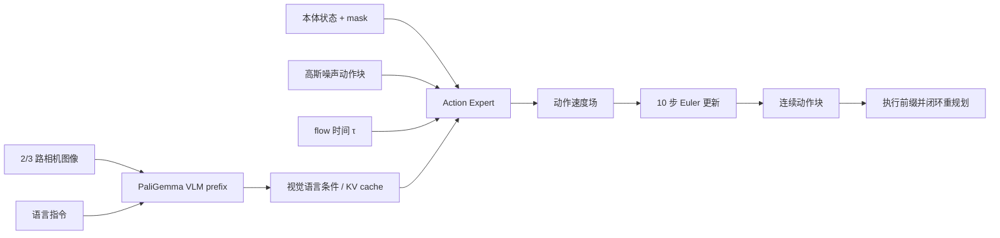

# π0: A Vision-Language-Action Flow Model for General Robot Control

> [论文](https://arxiv.org/abs/2410.24164) · [官方 PDF](https://www.physicalintelligence.company/download/pi0.pdf) · [当前官方 openpi 仓库](https://github.com/Physical-Intelligence/openpi)

## 证据标签

- **论文原文结论**：作者在论文中提出并由论文证据支持的主张。
- **客观事实**：可由公式、表格、附录或官方实现核验。
- **我们的解释**：为连接 VLM、flow matching 与闭环控制所做的解释。
- **尚未验证的猜测**：超出论文实验覆盖的推测。

## 论文地图

| 要素 | 内容 |
|---|---|
| 目标 | 用一个通用 VLA 控制多种机器人，覆盖灵巧、长时程与语言条件任务 |
| 基础模型 | 约 3B 参数 PaliGemma VLM + 约 300M 参数 action expert，总计约 3.3B |
| 动作生成 | 对连续动作块做 conditional flow matching，而非逐维离散 token |
| 数据 | 约 10,000 小时、7 种机器人配置、68 项任务，结合自有数据与 Open X-Embodiment |
| 训练策略 | 大规模多任务预训练，再对目标任务 post-training |
| 推理 | 噪声动作块经有限步 Euler 更新；复用视觉语言 prefix 的 KV cache |
| 主要边界 | 大量非公开训练数据、真实机器人评测成本、动作/状态统一与实时延迟 |

论文把两条主线合并：预训练 VLM 提供语义与视觉条件，action expert 用 flow matching 表达高频连续动作分布。作者把贡献描述为一种整合式通用策略，而不是声称发明 VLM 或 flow matching 本身。

## 论文试图解决的具体问题

单任务模仿学习策略能完成精确操作，但每个任务重新收集数据和训练，跨机器人迁移弱。早期通用 VLA 借助大规模数据提升语义泛化，却常把动作离散为 token，可能不适合高频、精细和多峰连续控制。机器人数据规模远小于互联网文本/图像，还分散在不同机构与 embodiment。

π0 的具体问题是：如何保留预训练 VLM 的语义能力，同时用适合连续控制的动作生成机制，在多机器人、多任务数据上预训练，再高效适配复杂任务。**论文原文结论**：预训练 + post-training 的 π0 能在论文覆盖的多类机器人任务上优于从头训练和若干通用策略基线，并完成折衣、装箱等复杂行为。

## 前序方法及其真正限制

RT-1/RT-2/OpenVLA 将动作离散化后作为 token 预测，接口统一但存在量化与自回归开销。ACT 预测动作 chunk 并通过序列建模提高双臂操作连贯性，但通常是任务/平台级训练。Diffusion Policy 能表达连续多峰动作，但需要扩散采样与特定视觉策略架构。Octo 等开放通用策略强调跨数据集预训练，却受模型、数据和任务覆盖限制。

π0 的差别不是“连续一定优于离散”，而是选择 flow matching 生成整个动作块，并让动作 token 之间双向交互。它还把 action expert 的参数与主 VLM 部分区分，以较小动作分支处理连续控制。**我们的解释**：这更像共享语义前缀、专门化动作后缀，而不是与 VLM 完全隔离的第二个模型。

## 核心假设与方法概览

1. 视觉语言预训练能提供跨任务语义先验。
2. 多 embodiment 机器人数据中存在可共享的视觉—语言—动作规律。
3. 连续动作块可通过条件向量场从高斯噪声生成，避免固定动作词表。
4. action expert 不必复制完整 VLM 容量，约 300M 参数即可承担动作路径建模。
5. 预训练负责广度，post-training 用高质量目标数据塑造具体技能与指令分布。

输入前缀包含 2 或 3 路图像（依机器人配置）、语言指令与本体状态；状态与动作填充到统一最大 18 维并配 mask。动作后缀包含一段带噪动作块及 flow 时间。论文报告系统使用长度 50 的动作块；实际覆盖的物理时间取决于各平台控制频率。

## 模型输入、输出及完整数据流

视觉和文本前缀只由当前观测构造；动作后缀能读取前缀，并在动作 token 间使用完整双向注意力，因为它们代表同一次迭代中的整块带噪变量，不是 teacher-forced 的未来真值 token。前缀不能读取动作后缀，因而可在每个 flow step 复用 KV cache。

## 核心公式逐步推导

### 条件 flow matching 动作路径

设真实动作块为 $A\in\mathbb R^{H\times d_a}$，噪声 $\epsilon\sim\mathcal N(0,I)$，flow 时间 $\tau\sim U[0,1]$。使用线性路径

$$
A^\tau=\tau A+(1-\tau)\epsilon.
$$

对 $\tau$ 求导：

$$
\frac{dA^\tau}{d\tau}=A-\epsilon.
$$

因此给定观测条件 $c$，action expert 训练为

$$
\mathcal L_{flow}(\theta)=
\mathbb E_{A,\epsilon,\tau}
\left\lVert v_\theta(A^\tau,\tau,c)-(A-\epsilon)\right\rVert_2^2.
$$

网络看不到干净 $A$，只看到插值状态 $A^\tau$、时间与条件；最优平方损失解是条件速度的期望。与图像 Flow Matching 相同，训练不需要积分整条 ODE。

### Euler 推理

推理初始化 $A^0\sim\mathcal N(0,I)$。把 $[0,1]$ 分为 $N$ 步，$\Delta\tau=1/N$：

$$
A^{\tau+Delta\tau}=A^\tau+Delta\tau
v_\theta(A^\tau,\tau,c).
$$

论文系统使用 10 个 Euler step。每步重新计算动作后缀表示，但视觉语言前缀不变，可缓存 KV。最终 $A^1$ 解归一化为物理动作。**客观事实**：10 步是论文配方，不是 flow matching 的数学要求；更少/更多步改变延迟和离散误差。

### 状态与动作归一化

不同机器人动作范围不同，训练通常对每个数据来源按统计量归一化，再 pad 到 18 维。若简单写成

$$
\tilde a_j=2\frac{a_j-q_{j,01}}{q_{j,99}-q_{j,01}}-1,
$$

推理后要用完全相同的统计反变换。padding 维必须由 mask 排除 loss；否则模型会在不存在的关节维上学习固定零，扭曲不同 embodiment 的权重。

## 网络结构、张量形状与注意力

PaliGemma 约 3B 参数，action expert 约 300M，总计约 3.3B。设 batch $B$、动作长度 $H=50$、统一动作维 $D=18$。原始动作块形状 `[B,50,18]`，可先由每个时间步的线性层映射到 action expert hidden dimension，形成 50 个动作 token；状态投影提供额外条件 token。

注意力 mask 可抽象为块矩阵：

$$
M=\begin{bmatrix}
M_{prefix\leftrightarrow prefix} & -\infty\\
M_{action\leftarrow prefix} & M_{action\leftrightarrow action}
\end{bmatrix}.
$$

右上角禁止前缀读取动作，左下角允许动作读取前缀，右下角动作块内部全连接。这里“action expert”指一组专门权重与 token 路径；它仍通过注意力读取 VLM 条件，不能描述成完全独立黑盒。

## 训练流程与推理流程的区别

预训练阶段混合多机器人、多任务数据，学习广泛条件控制。post-training 阶段用目标技能的高质量数据继续训练，使语言和动作分布匹配部署任务。长时程任务还可由高层视觉语言策略生成子任务指令，π0 作为低层执行策略；若使用该层级方案，成功不能全部归因于单一低层模型。

训练每个样本随机一个 $\tau$ 并做一次速度回归；推理从噪声开始调用 action expert 10 次。训练使用真动作构造 $A^\tau$，推理没有真动作；这不是 teacher forcing，因为监督对象是速度，而非把未来动作 token 直接放进可见上下文。

真实执行通常只采用 chunk 前部并重新观测。若完整 50 步开环执行，后段动作对扰动不敏感；论文能力要结合其控制循环、action horizon 与平台频率理解。

## 数据集、评测协议、基线与指标

论文描述约 10,000 小时机器人数据、7 种机器人配置与 68 项任务；自有数据约 903M timesteps，并加入 Open X-Embodiment。规模远大于普通实验室数据，使模型有机会学习跨任务共性，也造成完整复现几乎不可能。

评测包含桌面操作、移动操作、双臂灵巧任务与长时程任务；基线包括从头训练策略、Octo、OpenVLA 等通用/任务策略。主要指标是成功率，并按任务设置判定标准。论文还比较预训练、架构和 action expert 变体，以判断性能是否来自数据规模或模型设计。

不同基线可能使用不同预训练数据、动作表示、参数量与推理频率。即使部署在同一机器人，checkpoint 的可见数据也不一致；因此“通用策略 A 高于 B”是系统级比较，不是单变量动作头比较。

## 主实验、消融实验与关键图表解读

主实验显示 π0 在多种任务类别上优于对照，并能完成折叠衣物、整理桌面、把物品装盒等长序列任务。**论文原文结论**：大规模预训练显著提升下游性能，post-training 能把通用能力聚焦到复杂任务。

预训练消融对比从头训练与通用 checkpoint，支持跨任务数据带来正迁移。架构消融比较 flow matching action expert 与其他动作输出设计，支持连续动作专家在论文任务中的选择。数据消融说明来自不同平台/任务的数据对下游有作用，但由于 mixture 与训练步数高度耦合，很难把每一小时数据的边际贡献解释为因果常数。

长时程演示应区分低层策略与高层指令分解。若高层系统根据当前图像不断给出“拿起衣物边缘”等子命令，最终任务成功来自层级组合。**我们的解释**：π0 更准确的定位是强通用低层 VLA 加可选高层规划，而非单次自然语言输入后自主完成任意长任务。

## 每条主要结论是否被证据支持

| 结论 | 证据 | 审读判断 |
|---|---|---|
| 预训练改善复杂机器人任务 | 多任务对比与消融 | 在论文数据/平台内有力 |
| flow matching 适合连续动作块 | 动作头实验与任务结果 | 有支持，但并非对所有离散/扩散头穷尽比较 |
| 一个模型可控制多种机器人 | 7 种配置与多类任务 | 支持“覆盖多种”，不等于任意新机器人零样本 |
| 可完成长时程灵巧任务 | 真实系统演示 | 有证据；部分结果依赖高层子任务策略 |
| 规模是唯一关键因素 | 架构、数据质量与 post-training 也变化 | 不支持 |

## 论文局限、失败条件与混淆因素

1. 大部分自有训练数据不可完整获得，第三方无法复现预训练分布。
2. 10,000 小时与真实机器人基础设施超出普通研究者预算。
3. 7 种机器人仍是有限集合；新 embodiment 的零样本泛化证据有限。
4. 成功率受 trial 数、操作者重置、任务容差与安全策略影响。
5. flow matching 推理需要多次网络调用，控制延迟和尾延迟必须测量。
6. 动作/状态 pad 到 18 维依赖正确 mask、坐标和统计 registry。
7. 长时程成功可能混合高层策略、人工任务分段与低层 π0 能力。
8. 论文规模使严格数据消融昂贵，数据多样性、质量和数量不易完全分离。

## 官方代码结构、运行环境与复现成本

当前 `openpi` 仓库提供模型代码、部分 checkpoint、数据转换和微调/推理入口；它是后续维护项目，具体默认值可能与 2024 论文版本不同。复现必须锁定 commit、模型 variant、action normalization、机器人配置与推理步数。

加载 3.3B 模型和训练 action expert 需要 GPU；完整预训练还需要大规模数据管线与集群。公开 checkpoint 可以验证静态推理和小数据微调，但不能重现“10,000 小时训练产生了哪些能力”的因果过程。真实机器人部署需要低层控制器、相机标定、急停、动作限幅和延迟监控。

## 可在现有算力执行的最小复现方案

1. **公式单测**：随机生成动作 $A,\epsilon,\tau$，有限差分验证 $dA^\tau/d\tau=A-\epsilon$。
2. **二维条件流**：先在合成连续轨迹上训练小 action expert，比较 5/10/20 Euler steps 的误差与延迟。
3. **官方 checkpoint 离线推理**：用许可证允许的公开样本，验证图像/语言/state 输入、18 维 mask、50 步输出与反归一化。
4. **小规模微调**：选择一个公开单机器人数据集，仅做 LoRA 或 action expert 微调；与 frozen checkpoint/从头小模型比较。
5. **评测**：报告每动作维 L1、chunk 平滑度、推理平均/P95 延迟；若无安全平台，不做真实 rollout。

若以后在机器人上测试，先用回放/仿真验证动作范围，再空载低速、设置 workspace 限制和人工急停。公开结果只能包含已公开基线与白名单配置，不能暴露私有研究轨迹。

## 与其他论文、课程知识和 VLA 主线的关系

π0 直接把 Flow Matching 的条件向量场用于动作空间：$x_1$ 从图像变为动作块，条件从类别变为视觉、语言和状态。它保留 Transformer 作为多模态信息路由，又避免 OpenVLA 的 256-bin 离散动作。两者比较时必须对齐数据与机器人，不能把论文成功率直接相减。

动作分块章节解释了 $H=50$ 与执行步数并非一回事；控制系统可只执行前缀再重规划。LayerNorm、优化器和注意力课程则解释 3.3B 模型的训练稳定性基础，但论文成功还来自数据、硬件和系统工程。

## 阅读后仍未解决的问题

1. 10 个 Euler step 中哪些可以蒸馏/减少而不损害接触任务？
2. action expert 的容量应如何随机器人数量、动作维和 horizon 扩展？
3. 跨 embodiment 共享来自视觉语义、动作原语还是数据相似性？
4. 预训练数据质量与数量的边际收益怎样分离？
5. 高层语言子任务与低层动作策略如何端到端评测责任归属？
6. 带接触不连续和关节约束的动作路径是否应使用非线性/流形 flow？

## 审读结论

π0 给出了一个有影响力的整合方案：PaliGemma 提供视觉语言前缀，较小 action expert 通过 flow matching 生成连续动作块，大规模跨机器人预训练后再 post-train。实验支持该系统在作者平台上的广泛能力，但非公开数据、硬件规模和层级控制使完整复现不可行。普通算力的合理目标是验证公式、数据接口、官方 checkpoint 与小规模微调，而非复制全部机器人结论。

**尚未验证的猜测**：连续 flow matching 在所有机器人任务上都优于离散 token。论文没有在完全对齐数据、参数、延迟和调参预算下穷尽动作表示；优势必须按控制频率、任务多峰性和硬件成本重新验证。
