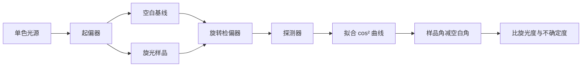

# 旋光度与马吕斯定律

## 学习目标

从电场投影推导马吕斯定律；区分起偏器、检偏器和旋光介质；使用空管/溶剂基线得到旋光角；解释比旋光度与浓度、光程、波长和温度的关系；建立包含背景光、有限消光比和角度零偏的拟合模型。

## 前置知识

需要电磁波横波性质、线偏振、强度与电场幅值平方的关系、三角函数与线性拟合。偏振片有允许电场分量通过的透振轴；实际器件并非理想，正交时仍可能有漏光。

## 核心概念与符号表

设入射线偏振电场幅值为 $E_0$，其方向与检偏器透振轴夹角为 $\theta$。理想检偏器只保留轴向投影 $E=E_0\cos\theta$。光强与时间平均 $E^2$ 成正比，因此

$$
\boxed{I=I_0\cos^2\theta}.
$$

这就是马吕斯定律。它适用于理想线偏振光与理想检偏器；若入射光部分偏振、探测器有背景或器件消光有限，需要扩展模型。

旋光介质使线偏振方向旋转。样品相对空白的净旋光角记为 $\alpha$。常用经验关系为

$$
\alpha=[\alpha]_{\lambda}^{T}lc,
$$

其中 $l$ 是光程，$c$ 是浓度，$[\alpha]_{\lambda}^{T}$ 是给定波长 $\lambda$ 和温度 $T$ 的比旋光度。数值单位取决于 $l,c$ 的约定；引用数值时必须把单位一起写出，不能只写一个“比旋光度”。

## 公式来源与推导

### 马吕斯定律不是强度的直接投影

投影发生在电场振幅：$E=E_0\cos\theta$。由于 $I\propto E^2$，才得到 $I/I_0=\cos^2\theta$。若错误地写成 $I=I_0\cos\theta$，在 $\theta>90^\circ$ 时会预测负光强，显然不合理。

### 更现实的强度模型

考虑背景 $I_b$、平行/垂直透过差异和角度零偏 $\theta_0$，可写

$$
I(\theta)=I_b+I_{\perp}+(I_{\parallel}-I_{\perp})
\cos^2(\theta-\theta_0).
$$

$I_{\perp}>0$ 表示有限消光；$\theta_0$ 同时吸收刻度零点和实际偏振方向。直接寻找最暗位置会受平坦极小值与噪声影响，用多角度数据拟合整个曲线通常更稳健。

### 旋光角的基线扣除

设空白条件下消光角为 $\theta_{blank}$，装入样品后的消光角为 $\theta_{sample}$，则

$$
\alpha=\operatorname{unwrap}(\theta_{sample}-\theta_{blank}).
$$

`unwrap` 表示根据仪器周期与旋向选择连续角度，因为检偏强度具有 $180^\circ$ 周期。空白测量能扣除起偏器初始方向、窗口双折射和部分机械零偏。若溶剂本身有旋光性，空白应使用同溶剂、同光程与同温度。

## 完整数值例子

使用光程 $l=1.00\,\mathrm{dm}$ 的样品管。空白拟合得到 $\theta_{blank}=12.4^\circ$，浓度 $c=0.200\,\mathrm{g\,mL^{-1}}$ 的溶液拟合得到 $\theta_{sample}=25.0^\circ$。净旋光角

$$
\alpha=25.0^\circ-12.4^\circ=12.6^\circ.
$$

在这一浓度/光程单位约定下，

$$
[\alpha]_{\lambda}^{T}=rac{12.6^\circ}{(1.00\,\mathrm{dm})(0.200\,\mathrm{g\,mL^{-1}})}
=63.0\,\mathrm{deg\,mL\,g^{-1}\,dm^{-1}}.
$$

若角度差标准不确定度 $u_\alpha=0.20^\circ$、光程相对不确定度 $0.5\%$、浓度相对不确定度 $1.0\%$，独立小误差近似给出

$$
\left(\frac{u_{[\alpha]}}{[\alpha]}\right)^2
=\left(\frac{0.20}{12.6}\right)^2+0.005^2+0.010^2
\approx(0.0194)^2,
$$

所以标准不确定度约 $1.2$ 个对应单位。注意这只是教学数据，不是原始实验结果。

## 实验数据流

建议正向、反向转动检偏器各测一次，以估计机械回差；多浓度测量时拟合 $\alpha$ 对 $c$ 的斜率，截距可检查未消除的零偏。若高浓度出现非线性，可能来自相互作用、折射率变化、温度或配制误差，不能强行过原点。

## 常见错误、适用条件与反例

1. **把振幅投影和强度投影混为一谈。** 强度是 $\cos^2\theta$。
2. **只测样品、不测空白。** 机械零点和窗口效应会混入旋光角。
3. **忽略波长与温度。** 比旋光度不是脱离条件的常数。
4. **浓度单位不写。** 同一数值在 g/mL、g/100 mL、质量分数约定下含义不同。
5. **把最暗处一次读数当真值。** 极小值附近曲线平，角度噪声大；应拟合多点并考虑背景。
6. **样品浑浊仍按纯旋光解释。** 散射、吸收和退偏会破坏理想模型。
7. **气泡与管窗应力未检查。** 它们会改变光路或引入双折射，属于系统效应。

## 与前后章节的关系

本节连接大学物理中的偏振、波的投影与光强，向后连接 Jones 向量、圆/椭圆偏振、双折射和光学传感。马吕斯定律也提供一个简单的非线性拟合案例，可练习残差分析与不确定度传播。

## 自测题与答案提示

1. 理想检偏器转过 $60^\circ$ 后强度为多少？提示：$I_0/4$。
2. 为什么强度曲线周期是 $180^\circ$？提示：透振轴方向相反但代表同一轴，$\cos^2$ 周期为 $\pi$。
3. 样品角和空白角都增加同一个机械零偏，净旋光角怎样？提示：理想相减后抵消。
4. 多浓度直线拟合有显著非零截距说明什么？提示：基线、配制或模型可能存在系统问题。

## 参考资料

- OpenStax University Physics, *Polarization*：线偏振与马吕斯定律。
- IUPAC Gold Book：optical rotation 术语与条件说明。

## 校对信息

最后校对：2026-07-21。掌握状态：复习中。单位、空白扣除和现实强度模型已核验；未包含身份信息或完整实验数据。

