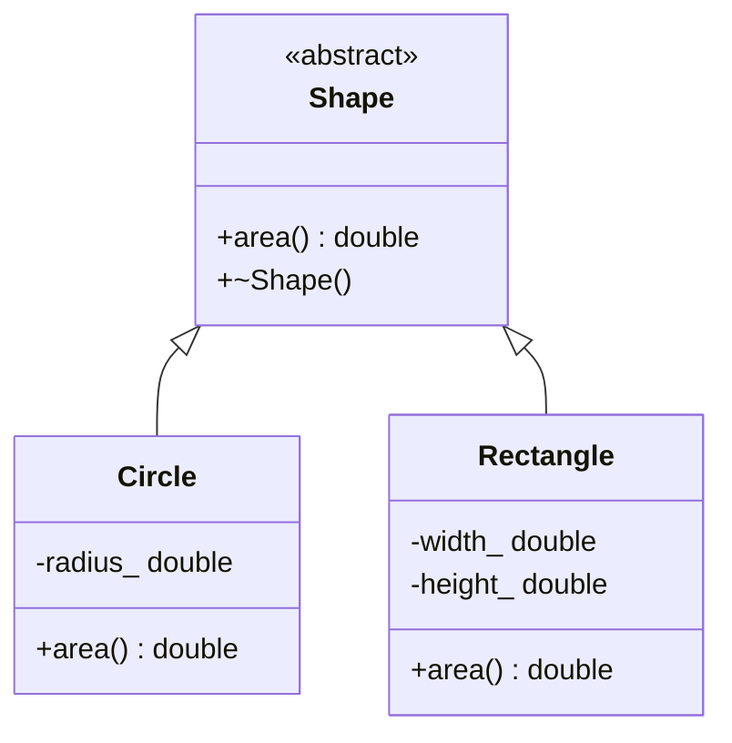

# 类、继承与运行时多态

## 学习目标

能够用类不变量设计构造函数；区分接口继承与实现复用；解释虚函数的动态派发、对象切片和虚析构；用 `override`、`final` 与智能指针写出可维护的多态接口；判断何时组合比继承更合适。

## 前置知识

需要函数重载、引用/指针、访问控制、构造与析构、RAII。运行时多态要求通过基类引用或指针访问派生对象；按值复制到基类会发生切片。

## 核心概念与符号表

类把状态、操作与不变量放在一起。例如 `Rectangle` 的宽高应始终非负；构造函数要么建立这个条件，要么失败，不应创建半有效对象。

继承 `class Derived : public Base` 表达“Derived 可在要求 Base 的位置使用”的 is-a 关系。虚函数允许调用目标由对象的动态类型决定。静态类型来自变量声明，动态类型来自运行时实际对象。

一个常见实现会在多态对象中保存虚表指针，虚表记录最终覆盖函数地址；但 C++ 标准规定的是可观察行为，并不强制具体虚表布局。教学时可以用虚表形成直觉，不能把某编译器 ABI 当成语言保证。

## 动态派发推导

```cpp
struct Shape {
    virtual double area() const = 0;
    virtual ~Shape() = default;
};

struct Circle final : Shape {
    explicit Circle(double radius) : r(radius) {
        if (r < 0) throw std::invalid_argument("negative radius");
    }
    double area() const override { return 3.141592653589793 * r * r; }
private:
    double r;
};
```

若 `Shape& s` 绑定到 `Circle` 对象，表达式 `s.area()` 先根据 `s` 的动态类型选择 `Circle::area`。`override` 让编译器检查基类是否存在签名匹配的虚函数，避免因少写 `const` 或参数不同而悄悄创建新函数。

为什么基类析构要虚？设 `Shape* p = new Circle(2)`，随后 `delete p`。删除表达式通过基类指针执行；若基类析构非虚，派生析构不会按多态链正确执行，行为未定义。使用 `std::unique_ptr<Shape>` 也依赖同一规则，因为默认删除器最终执行 `delete`。

对象切片来自按值复制：

```cpp
void print_area(Shape value); // 抽象基类甚至无法按值传
Base b = derived;             // 只复制 Base 子对象，派生部分被切掉
```

因此多态接口使用 `Base&`、`const Base&` 或拥有语义明确的智能指针。

## 完整代码例子：可扩展图形求和

```cpp
#include <cmath>
#include <memory>
#include <numeric>
#include <stdexcept>
#include <vector>

struct Shape {
    virtual double area() const = 0;
    virtual ~Shape() = default;
};

class Circle final : public Shape {
public:
    explicit Circle(double r) : radius_(r) {
        if (r < 0) throw std::invalid_argument("negative radius");
    }
    double area() const override { return std::acos(-1.0) * radius_ * radius_; }
private:
    double radius_;
};

class Rectangle final : public Shape {
public:
    Rectangle(double w, double h) : width_(w), height_(h) {
        if (w < 0 || h < 0) throw std::invalid_argument("negative side");
    }
    double area() const override { return width_ * height_; }
private:
    double width_, height_;
};

double total_area(const std::vector<std::unique_ptr<Shape>>& shapes) {
    double total = 0.0;
    for (const auto& shape : shapes) total += shape->area();
    return total;
}

int main() {
    std::vector<std::unique_ptr<Shape>> shapes;
    shapes.push_back(std::make_unique<Circle>(2.0));
    shapes.push_back(std::make_unique<Rectangle>(3.0, 4.0));
    const double result = total_area(shapes);
    // result = 4π + 12 ≈ 24.566
}
```

容器拥有异构对象，`unique_ptr` 保留各对象动态类型并负责销毁。`total_area` 只借用容器，不转移所有权。新增 `Triangle` 不需要改求和函数，体现面向接口扩展。

## 对象关系图



## 组合还是继承

继承适合稳定的替换关系：任何使用 `Shape` 的代码都可以接受 `Circle`。若只是“汽车有发动机”，应使用组合 `Car` 包含 `Engine`，而不是 `Car` 继承 `Engine`。组合减少基类变化对派生类的耦合，也能在运行时替换策略。

Liskov 替换原则要求派生类型不加强前置条件、不削弱后置条件，并保持基类不变量。经典反例是让 `Square` 继承可分别设置宽高的 `Rectangle`：若 `set_width` 不同时改高度，正方形不变量破坏；若同时改，又违背调用者对矩形 setter 的预期。更好的模型是不可变尺寸值类型，或让两者都实现 `Shape`。

## 常见错误、适用条件与反例

1. **基类析构非虚却通过基类指针删除。** 这是未定义行为；多态基类通常声明 `virtual ~Base() = default`。
2. **忘记 `override`。** 参数、引用限定或 `const` 不匹配时不会覆盖预期函数。
3. **构造/析构中依赖虚派发。** 此时对象的派生部分尚未构造或已经析构，调用不会像完整对象那样派发。
4. **把继承当作代码复用捷径。** 私有成员、基类不变量和耦合会让“复用几行实现”代价很高；先考虑组合或自由函数。
5. **按值保存多态对象。** `std::vector<Base>` 会切片；使用 `std::vector<std::unique_ptr<Base>>` 或其他类型擦除方案。
6. **把虚表布局当成标准。** 对性能与 ABI 的讨论必须注明编译器、平台和优化设置。

## 与前后章节的关系

本节依赖 RAII：多态对象应由智能指针管理。向后连接工厂模式、依赖注入、类型擦除、模板静态多态和异常安全。VLA/C++ 推理系统中，设备后端接口常用运行时多态，但高频内核可能偏向模板以减少间接调用；选择应由性能测量决定。

## 自测题与答案提示

1. 为什么 `virtual` 通常只写在基类，而派生类写 `override`？提示：覆盖关系会沿继承链保持；`override` 提供编译期检查。
2. `final` 可用于哪里？提示：可禁止类继续派生，也可禁止某个虚函数继续覆盖。
3. 何时纯虚函数仍可以有定义？提示：语言允许提供定义，但类仍抽象；析构等场景可能显式调用。
4. 如何避免图形例子中的堆分配？提示：若类型集合封闭，可考虑 `std::variant` 与 `std::visit`，用代数数据类型表达。

## 参考资料

- C++ Core Guidelines：C.120–C.152 类层次规则。
- cppreference：virtual function、abstract class、destructor 与 object slicing 相关条目。

## 校对信息

最后校对：2026-07-21。掌握状态：复习中。示例使用 C++17 接口并核对面积结果；后续补充 `std::variant` 与虚函数方案的可维护性/性能对比。

