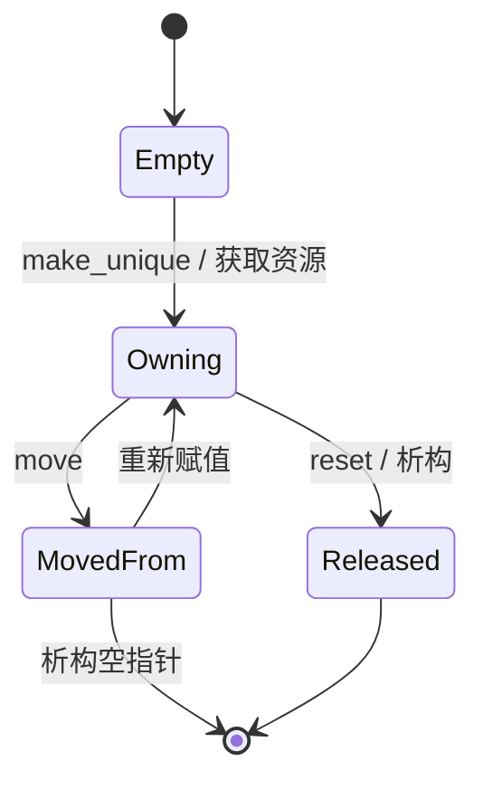

# 指针、所有权与 RAII

## 学习目标

区分地址、对象生命周期与资源所有权；理解裸指针本身不说明谁负责释放；使用 RAII 把资源生命周期绑定到对象；根据所有权语义选择值、引用、`std::unique_ptr`、`std::shared_ptr` 与 `std::weak_ptr`；解释移动语义为什么允许转移唯一所有权。

## 前置知识

需要变量、作用域、函数、类的构造/析构、栈与自由存储区的基本概念。这里的“资源”不只指内存，也包括文件句柄、锁、socket、GPU buffer 等必须成对获取/释放的实体。

## 核心概念与符号表

指针 `T*` 保存一个可解释为 `T` 对象地址的值；引用 `T&` 是已有对象的别名。**所有权**回答“谁保证资源最终被释放”，**生命周期**回答“对象在哪段时间内存在”。二者相关但不等同：观察者可以持有指针却不拥有对象。

RAII（Resource Acquisition Is Initialization）要求构造函数建立类不变量并获取资源，析构函数释放资源。只要对象的作用域退出，无论是正常返回还是异常展开，析构都会执行。这把控制流问题转化为类型问题。

| 表达 | 常见语义 | 能否为空 | 是否拥有 |
|---|---|---:|---:|
| `T` | 值语义 | 否 | 对自身资源负责 |
| `T&` | 必须存在的借用 | 否 | 否 |
| `T*` | 可空观察或底层接口 | 是 | 默认不表达 |
| `std::unique_ptr<T>` | 唯一所有权 | 是 | 是 |
| `std::shared_ptr<T>` | 共享所有权 | 是 | 是，引用计数 |
| `std::weak_ptr<T>` | 对共享对象的非拥有观察 | 是 | 否 |

## 机制推导：为什么裸 `new/delete` 容易出错

考虑：

```cpp
Widget* p = new Widget();
do_work();              // 可能抛异常
delete p;
```

若 `do_work()` 抛异常，控制流跳过 `delete`，资源泄漏。把资源放进 `std::unique_ptr`：

```cpp
auto p = std::make_unique<Widget>();
do_work();
```

编译器在离开作用域时自动调用 `p` 的析构；`unique_ptr` 析构再对受管对象调用删除器。异常改变控制流，但不破坏作用域析构规则。

`unique_ptr` 禁止复制，是因为复制会产生两个“唯一拥有者”。它允许移动：移动构造把内部指针从源对象转到目标对象，并令源为空。语义可写成

$$
(p_{src},p_{dst})=(a,\varnothing)\longrightarrow(\varnothing,a).
$$

这不是复制对象内容，而是转移释放责任。

`shared_ptr` 维护控制块，通常含强引用计数与弱引用计数。当最后一个强引用销毁时对象析构；控制块可能等到最后一个弱引用销毁才释放。引用计数不能解决环：若 A 与 B 都用 `shared_ptr` 拥有对方，两个强计数永不归零。至少一条回边应改为 `weak_ptr`。

## 完整代码例子：异常安全文件读取

标准库流本身就是 RAII 封装。下面的函数不需要手写关闭文件；所有退出路径都会析构 `std::ifstream`。

```cpp
#include <fstream>
#include <stdexcept>
#include <string>

std::string read_first_line(const std::string& path) {
    std::ifstream input(path);
    if (!input) {
        throw std::runtime_error("cannot open file");
    }

    std::string line;
    if (!std::getline(input, line)) {
        throw std::runtime_error("cannot read first line");
    }
    return line;
} // input 在此析构；异常路径也一样
```

若必须封装 C API，可以给 `unique_ptr` 自定义删除器：

```cpp
#include <cstdio>
#include <memory>

using File = std::unique_ptr<std::FILE, decltype(&std::fclose)>;

File open_file(const char* path) {
    File file(std::fopen(path, "rb"), &std::fclose);
    if (!file) throw std::runtime_error("open failed");
    return file; // 移动返回所有权
}
```

`fopen` 与 `fclose` 的配对现在由类型保证。`File` 不能复制，避免重复关闭。

## 生命周期数据流



## 常见错误、适用条件与反例

1. **“裸指针就是拥有者”。** `T*` 没有统一所有权语义；接口必须通过类型、命名或文档说明。现代 C++ 优先让拥有关系出现在 RAII 类型中。
2. **对同一地址构造两个 `shared_ptr`。** 两个独立控制块都会删除同一对象，导致未定义行为。应从同一个 `shared_ptr` 复制。
3. **用 `shared_ptr` 解决所有生命周期问题。** 共享所有权增加原子计数成本并可能形成环；默认先考虑值或 `unique_ptr`。
4. **返回局部变量引用/指针。** 函数返回后局部对象已销毁，观察者悬空。
5. **移动后继续假设原对象内容。** 标准保证对象“有效但状态未指定”时，只能执行该类型允许的操作；`unique_ptr` 明确变为空。
6. **手写析构但忽略复制/移动。** 管理资源的类应遵循 Rule of Zero；若必须手写，需系统处理五个特殊成员函数。

## 与前后章节的关系

本节连接类的构造/析构与后续异常安全、容器、并发锁。理解所有权后，运行时多态中的 `std::unique_ptr<Base>`、工厂函数返回值和依赖注入才不会退化为裸 `new`。

## 自测题与答案提示

1. 只读取参数且要求非空，应优先 `const T&` 还是 `const T*`？提示：前者直接表达非空借用。
2. 图结构的父节点拥有子节点、子节点观察父节点，分别用什么？提示：父到子可用 `unique_ptr`，子到父用非拥有指针/引用；若整体共享，再考虑 `weak_ptr`。
3. 为什么 `make_shared` 通常比 `shared_ptr<T>(new T)` 更好？提示：更简洁，通常把对象与控制块一次分配，并减少中间异常风险。
4. `delete nullptr` 是否安全？提示：安全；但这不代表悬空指针安全。

## 参考资料

- C++ Core Guidelines：R.1–R.37 资源管理规则。
- cppreference：smart pointers、object lifetime 与 move semantics。

## 校对信息

最后校对：2026-07-21。掌握状态：复习中。代码示例按 C++17 语义检查；后续补充异常安全的 basic/strong/no-throw guarantee。

